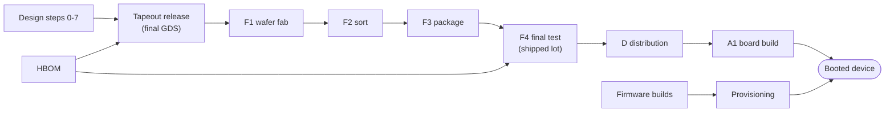

# HSLSA: Hardware Supply Chain Security Framework

HSLSA is a framework for proving how a chip or board was made, the way [SLSA](https://slsa.dev), SBOMs and [in-toto](https://in-toto.io) do for software. Every party that touches a part (design house, foundry, OSAT, distributor, board assembler, firmware team) signs a small record of what it did, the records link to each other by digest, and a buyer checks the whole chain before accepting parts or letting a device boot into its fleet.

This README is the entry point for anyone new to the project, whether you are here to contribute, to review the spec, or to run the pilot as a buyer or supplier. It explains the ideas, says where everything lives, and links to the documents that go deeper.

**Status:** working draft, spec version 0.1, [revision 17](spec/hslsa-v0.1.md#changelog) (2026-10-02). Everything runs in CI on real open-source designs and tools, with simulated fab, packaging and test data, and every record made from simulated hardware says so. No company outside this repository signs records yet; the [pilot kit](pilot/README.md) is how that starts. The repository is private by the owner's choice.

## Contents

- [Why this exists](#why-this-exists)
- [Core ideas in five minutes](#core-ideas-in-five-minutes)
- [What a signed record proves, and what it does not](#what-a-signed-record-proves-and-what-it-does-not)
- [Where to start, by role](#where-to-start-by-role)
- [Repository layout](#repository-layout)
- [Building and testing](#building-and-testing)
- [The `hslsa` reference tool](#the-hslsa-reference-tool)
- [Worked examples](#worked-examples)
- [Supplier adapters](#supplier-adapters)
- [The pilot kit](#the-pilot-kit)
- [CI](#ci)
- [Project status and roadmap](#project-status-and-roadmap)
- [Contributing](#contributing)
- [Identifiers](#identifiers)
- [License and security](#license-and-security)

## Why this exists

Software has a working answer to "how was this built, and can I check it?": SLSA levels, signed provenance, SBOMs, transparency logs. Hardware has nothing equivalent. A chip passes through many companies, each of which keeps its own records in its own systems, and a buyer who wants to know that a part came from the design they approved, through the fab and test house they expected, with the firmware they reviewed, has to trust paperwork.

HSLSA borrows the software ideas and fills in what hardware needs: levels per supply chain stage, signed records for physical steps (wafer lots, packaged units, board builds), naming physical things by device identity (DICE or Caliptra class), and a hardware bill of materials that ties the design and the shipped parts together. It reuses existing standards wherever one fits (SLSA provenance, in-toto, DSSE, CycloneDX, SPDX, CoRIM, OCP S.A.F.E., SEMI E142, STDF) and is written up as the semiconductor profile of [NIST IR 8536](https://doi.org/10.6028/NIST.IR.8536), NIST's manufacturing traceability meta-framework ([profile](spec/nist-ir-8536-profile.md)). The [spec's standards table](spec/hslsa-v0.1.md#relationship-to-existing-standards) maps each piece to what it reuses.

## Core ideas in five minutes

### Tracks and levels

A product is rated per **track**, never overall. There are five tracks:

| Track | Covers | Who runs it |
| --- | --- | --- |
| Design | RTL, IP, PDK, EDA flow to GDSII (or an FPGA bitstream), mask ROM contents | Design house |
| Wafer | Mask making, wafer fabrication, wafer sort | Foundry, mask shop, sort house |
| Package/Test | Packaging, final test | OSAT, test house |
| Assembly | Part shipments, their receipt, board and system build | Distributors, EMS |
| Firmware | Boot ROM, device and board firmware, provisioning | Firmware team, programming stations |

Each track has **levels**, cumulative within the track:

| Level | Name | What the buyer can verify |
| --- | --- | --- |
| L0 | No claim | Nothing |
| L1 | Provenance exists | A complete record of how the item was made, in a standard format |
| L2 | Signed by the producer | The record was signed by a controlled platform or site, not typed by hand |
| L3 | Hardened | Keys and build steps isolated, inputs pinned, the subject rooted in a hardware identity |
| L4 | Independently verified (optional defense profile) | A second, independent party rebuilt or physically inspected the item and got the same answer |

A claim reads like `Design L3, Wafer L2, Package/Test L2, Assembly L1, Firmware L2`. The full requirement table per track and level is in the spec's [Tracks and levels](spec/hslsa-v0.1.md#tracks-and-levels).

### The attestation chain

Every step emits an in-toto statement in a DSSE envelope. Each statement names what it consumed and what it produced by digest, so a verifier holding a booted device can walk from its identity certificate to the shipped lot, back through packaging and the wafer lot to the signed GDS, and from there to reviewed RTL and every tool and PDK used.



The step list (design steps 0 to 7, F1 to F4, transfers, distribution, receipt, A1, provisioning, rebuild, inspection) and what each consumes and produces is in [The attestation chain](spec/hslsa-v0.1.md#the-attestation-chain). Physical things are named by URNs under `urn:hslsa:` plus a digest of a canonical list: the **lot digest** over the units that passed final test is what ties the HBOM to the parts in a reel.

### The HBOM

The hardware bill of materials is one signed in-toto statement whose subjects are the design (the final GDS, or the board design) and the lot (the shipped lot, or the board lot). It points at every record in the chain and lists IP blocks, firmware images and, for a board, each part with its own chain. Its JSON Schema is [`hbom/hbom-predicate-v0.1.schema.json`](hbom/hbom-predicate-v0.1.schema.json), and `hslsa render` writes it as CycloneDX 1.6 and SPDX 3.1-RC1 so existing SBOM tools can read it ([Renderings](spec/hslsa-v0.1.md#renderings)).

### The checks a buyer runs

The verifier runs the same few checks in every example ([Where the chain is checked](spec/hslsa-v0.1.md#where-the-chain-is-checked)):

- **Tapeout check**, before the GDS leaves for the foundry: every design step present, signed, linked, on approved tools and PDKs, gates passed.
- **Lot receipt check**, when parts arrive: F1 to F4 present and linked, every step names the same GDS, genealogy complete, every received unit is in the shipped lot. It reports every gap at once, by track.
- **Board receipt check**: the same for a board and each part on it.
- **At-boot check**: the device proves its identity and firmware measurements, and they match the provisioning records and the firmware reference values (CoRIM).

A passing check signs a SLSA Verification Summary Attestation (VSA) per track, which the official [slsa-verifier](https://github.com/slsa-framework/slsa-verifier) can read.

### The buyer decides what it trusts

Which keys count, which levels are required and whether records signed on a supplier's behalf are accepted are the buyer's decisions, written in the buyer's **trust root** and **policy**. The framework supplies the tools and sample policies; nothing in it lets a supplier choose the keys a buyer trusts. In the pilot the buyer runs its own trust root from signed key enrollments ([Buyer-run trust roots](spec/hslsa-v0.1.md#buyer-run-trust-roots)).

### Other ideas you will meet

- **Proxy signing.** A supplier that signs nothing can still appear in the chain: whoever received its output signs a record on its behalf, from the supplier's own data, and that caps the track at L1 ([docs](docs/proxy-signing.md)).
- **Selective disclosure and verifier escrow.** Records can withhold confidential fields behind salted digests; an auditor sees everything, the buyer sees only the auditor's VSAs ([docs](docs/selective-disclosure.md)).
- **Simulated hardware, marked.** A record made from a simulator says so, the verifier refuses it unless the buyer's policy accepts simulated evidence, and every VSA over it states `HSLSA_SIMULATED`. The virtual shuttle makes a lot's supplier exports by simulating the released netlist on every die, with seeded defects ([docs](docs/simulated-hardware.md)).
- **Firmware L2 through a board root of trust.** A part with no secure-boot ROM can reach Firmware L2 on a board whose attested root of trust verifies the flash before the SoC runs ([spec](spec/hslsa-v0.1.md#core-requirements), [example](docs/fpga-board-example.md)).
- **Private transparency logs.** Every L3 log requirement can be met by a private log, since no foundry publishes lot ids or yields.

The spec's [Terminology](spec/hslsa-v0.1.md#terminology) table defines every term used in the records.

## What a signed record proves, and what it does not

A signature proves which party made a claim and that nobody changed it afterwards. It does **not** prove the claim is physically true: Wafer L3 does not mean "no trojans". Levels L1 to L3 make records tamper-evident and their signers accountable; only the L4 defense profile examines physical parts, and only a sample of them. Read the [threat model](spec/hslsa-v0.1.md#threat-model) before relying on a level, and the [viability assessment](docs/viability.md) for which tracks are realistic today (Firmware is ready now; Package/Test and Design L1 to L2 are plausible with a large customer; foundries and Design L3 with commercial EDA are hard).

## Where to start, by role

| You are | Read, in order |
| --- | --- |
| New to the project | This README, then the spec's [Overview](spec/hslsa-v0.1.md#overview) and [Tracks and levels](spec/hslsa-v0.1.md#tracks-and-levels), then one example: [e2e-test.md](docs/e2e-test.md) (PicoRV32) is the simplest |
| Reviewing the spec | [spec/hslsa-v0.1.md](spec/hslsa-v0.1.md), [threat model](spec/hslsa-v0.1.md#threat-model), [open questions](spec/hslsa-v0.1.md#open-questions), [NIST IR 8536 profile](spec/nist-ir-8536-profile.md) |
| Contributing code | [Building and testing](#building-and-testing), [Contributing](#contributing), then the example closest to what you are changing |
| A buyer in the pilot | [pilot/README.md](pilot/README.md), then [pilot/buyer.md](pilot/buyer.md) |
| A supplier (OSAT, RoT vendor) in the pilot | [pilot/README.md](pilot/README.md), then [pilot/supplier.md](pilot/supplier.md) |
| A chip vendor who received the kit before any buyer | [pilot/vendor.md](pilot/vendor.md) |
| Deciding whether this can work | [docs/viability.md](docs/viability.md), then [docs/roadmap.md](docs/roadmap.md) |

## Repository layout

```
spec/            the specification and the NIST IR 8536 profile
docs/            one page per example, adapter and feature, plus roadmap and viability
tools/hslsa/     the Go reference tool and verifier (library and tests)
  cmd/hslsa/     the hslsa command
  testdata/      throwaway test keys and fixtures
adapters/        the EDA Tcl hook (the other adapters are hslsa subcommands)
policies/rego/   buyer policies in Rego for OPA, with their tests
hbom/            HBOM schema, committed example HBOMs and their renderings
  formats/       the official CycloneDX 1.6 and SPDX 3.1-RC1 schemas renderings are checked against
e2e/             inputs and scripts for each example: picorv32, board, fpga, caliptra, eda-tcl, pilot
openlane2/       the OpenLane 2 RTL-to-GDS example: pins, script overlay, run.sh
pilot/           the pilot kit: buyer, supplier and vendor guides, agreement, make-kit.sh
site/            the documentation website: page generator, templates, build.sh
.github/workflows/  the four CI workflows, the release workflow and the docs site build
```

| Path | What it is |
| --- | --- |
| [`spec/hslsa-v0.1.md`](spec/hslsa-v0.1.md) | The framework specification, with its changelog |
| [`spec/nist-ir-8536-profile.md`](spec/nist-ir-8536-profile.md) | HSLSA as the semiconductor profile of NIST IR 8536: event and record mapping, profile requirements, gaps on both sides |
| [`hbom/hbom-predicate-v0.1.schema.json`](hbom/hbom-predicate-v0.1.schema.json) | JSON Schema (2020-12) for the HBOM predicate |
| [`hbom/picosoc-sky130.hbom.intoto.json`](hbom/picosoc-sky130.hbom.intoto.json) | Example chip HBOM: a PicoRV32 SoC on SkyWater SKY130 |
| [`hbom/picosoc-sky130.shipped-lot.txt`](hbom/picosoc-sky130.shipped-lot.txt) | That example's shipped-lot unit list, for recomputing its lot digest |
| [`hbom/picosoc-devboard.hbom.intoto.json`](hbom/picosoc-devboard.hbom.intoto.json) | Example board HBOM: the PicoSoC and off-the-shelf parts, with `parts[]` and distributor lot data |
| `hbom/*.cdx.json`, `hbom/*.spdx.json` | Each example HBOM rendered as CycloneDX 1.6 and SPDX 3.1-RC1 |
| [`hbom/formats/`](hbom/formats/README.md) | The official CycloneDX 1.6 and SPDX 3.1-RC1 JSON Schemas |
| [`tools/hslsa/`](tools/hslsa) | The reference tool in Go |
| [`adapters/eda-tcl/`](adapters/eda-tcl/README.md) | The EDA Tcl hook, with notes for commercial tools |
| [`docs/e2e-test.md`](docs/e2e-test.md) | PicoRV32 end to end: real RTL flow, signed lot, buyer checks, slsa-verifier |
| [`docs/board-example.md`](docs/board-example.md) | Board example: signed shipments, A1 board build, board HBOM |
| [`docs/openlane2-flow.md`](docs/openlane2-flow.md) | OpenLane 2 RTL-to-GDS with a record per step and a bit-exact rebuild |
| [`docs/caliptra-e2e.md`](docs/caliptra-e2e.md) | Caliptra: pinned RTL, ROM and firmware to units that boot and prove their identity |
| [`docs/fpga-board-example.md`](docs/fpga-board-example.md) | iCE40 FPGA board whose attested root of trust verifies the flash, checked to Firmware L2 |
| [`docs/selective-disclosure.md`](docs/selective-disclosure.md) | Withheld fields, verifier escrow, and a measurement of what each view reveals |
| [`docs/proxy-signing.md`](docs/proxy-signing.md) | Records signed on behalf of a supplier that signs nothing |
| [`docs/mes-stdf-adapter.md`](docs/mes-stdf-adapter.md) | Manufacturing records from MES, STDF and SEMI E142 exports |
| [`docs/provisioning-adapter.md`](docs/provisioning-adapter.md) | Per-unit provisioning records from a programming station's export |
| [`docs/hsm-signing.md`](docs/hsm-signing.md) | Site keys held in an HSM over PKCS#11 |
| [`docs/simulated-hardware.md`](docs/simulated-hardware.md) | The virtual shuttle, the simulated mark on records, and what simulation proves and cannot |
| [`docs/viability.md`](docs/viability.md) | Which tracks are ready, which are hard, and why |
| [`docs/release.md`](docs/release.md) | Making a release, and pulling and running the `hslsa` container image |
| [`docs/roadmap.md`](docs/roadmap.md) | Phases from draft to real use, exit criteria, open owner decisions |
| [`docs/levels.md`](docs/levels.md) | What the reference tool checks at L3 and L4 in each track, and which example shows it |
| [`docs/rego-policies.md`](docs/rego-policies.md) | The tapeout, lot receipt and board receipt checks as Rego policies, run with OPA and openssl instead of the reference tool |
| [`pilot/`](pilot/README.md) | The pilot kit for one buyer |
| [`site/`](site/README.md) | The documentation website, built from the markdown above |

## Building and testing

You need Go at the version in [`go.mod`](go.mod) (the `toolchain` line; `go` downloads it if yours is older). Nothing else is needed for the tool and its unit tests.

```sh
go build -o bin/hslsa ./tools/hslsa/cmd/hslsa   # or: go run ./tools/hslsa/cmd/hslsa <command>
bin/hslsa help                                  # list the commands
go test ./...                                   # valid chains accepted, broken or forged ones refused
```

What CI's lint job runs, and what to run before you push:

```sh
gofmt -l .                                       # must print nothing
go vet ./...
go test ./...
go run golang.org/x/vuln/cmd/govulncheck@v1.7.0 ./...
go run ./tools/hslsa/cmd/hslsa validate-hbom hbom/picosoc-sky130.hbom.intoto.json hbom/picosoc-devboard.hbom.intoto.json
```

A first look with the committed examples, no keys or external tools needed:

```sh
bin/hslsa lot-digest hbom/picosoc-sky130.shipped-lot.txt
# 4876860b..., the lot subject digest in hbom/picosoc-sky130.hbom.intoto.json
bin/hslsa render --hbom hbom/picosoc-sky130.hbom.intoto.json --format cyclonedx
bin/hslsa render --hbom hbom/picosoc-sky130.hbom.intoto.json --check hbom/picosoc-sky130.cdx.json
```

To read all of this as one searchable website, run `site/build.sh` and open `site/public/index.html`; CI also uploads the built site with every change to the docs ([site/README.md](site/README.md)).

The HSM signing code needs cgo; a build with `CGO_ENABLED=0` (as in the pilot kit's binaries) works except for PKCS#11 keys. The HSM tests skip unless SoftHSM2 is installed ([hsm-signing.md](docs/hsm-signing.md)).

Each example script builds the tool into `bin/hslsa` itself (set `HSLSA` to use another binary) and writes everything under `out/`, which git ignores. Their extra requirements:

| Run | Needs, besides Go | Docs |
| --- | --- | --- |
| `SLSA_VERIFIER=/path/to/slsa-verifier e2e/run.sh all` | git, ssh-keygen (OpenSSH 8.2+), Yosys, Icarus Verilog, slsa-verifier; SoftHSM2 for the `hsm` step; the `shuttle` step takes a minute or two on four cores | [e2e-test.md](docs/e2e-test.md#running-it-locally), [simulated-hardware.md](docs/simulated-hardware.md#running-it) |
| `e2e/board/run.sh produce`, then `verify` | after `e2e/run.sh produce` | [board-example.md](docs/board-example.md) |
| `e2e/board/run.sh l3`, `l4` | after `e2e/run.sh l3`; bubblewrap and SoftHSM2 for the chip lot | [levels.md](docs/levels.md) |
| `e2e/escrow.sh produce`, `audit`, `buyer`, `leaks` | after `e2e/run.sh produce` | [selective-disclosure.md](docs/selective-disclosure.md) |
| `e2e/rego/run.sh out/bundle`, `out/board` | after `e2e/run.sh produce` / `e2e/board/run.sh produce`; OPA, openssl, ssh-keygen and jq, but no Go | [rego-policies.md](docs/rego-policies.md) |
| `e2e/eda-tcl/run.sh` | Yosys | [adapters/eda-tcl](adapters/eda-tcl/README.md) |
| `e2e/fpga/run.sh produce`, `boot`, `verify`, `l3`, `l4` | Yosys, nextpnr-ice40, IceStorm, Icarus Verilog, a RISC-V GCC; bubblewrap and SoftHSM2 for `l3` and `l4` | [fpga-board-example.md](docs/fpga-board-example.md) |
| `e2e/pilot/run.sh chip` / `board` | after `e2e/run.sh produce` / after the FPGA example's `produce` and `boot` | [pilot/README.md](pilot/README.md#the-rehearsal) |
| `SLSA_VERIFIER=... e2e/caliptra/run.sh all` | Verilator, rustup, slsa-verifier; the first build takes about 15 minutes | [caliptra-e2e.md](docs/caliptra-e2e.md#running-it-locally) |
| `openlane2/run.sh produce`, `rebuild`, `verify` | Docker, the SKY130 PDK installed with ciel | [openlane2-flow.md](docs/openlane2-flow.md#running-it-locally) |

Every example generates throwaway keys per run and signs with local ECDSA P-256 keys in DSSE envelopes. Nothing requests an OIDC token or uploads to a public transparency log, by design.

## The `hslsa` reference tool

One binary, built from [`tools/hslsa/cmd/hslsa`](tools/hslsa/cmd/hslsa/main.go). `hslsa help` lists the commands and `hslsa <command> --help` their flags. Grouped by what you use them for:

| Purpose | Commands |
| --- | --- |
| Keys and trust | `keygen`, `pubkey`, `keyid`, `hsm` (keys on a PKCS#11 token), `trust-root` |
| Producing records | `design` (one design step), `mfg` (F1 to F4), `hbom`, `openlane`, `eda`, `board`, `fpga`, `caliptra` |
| From supplier exports | `adapt` (MES, STDF, SEMI E142), `provision` (programming station), `eda` (Tcl hook) |
| Checking | `verify` (tapeout and lot receipt, then VSAs), `board`, `fpga` and `caliptra` verify actions, `escrow`, `validate-hbom`, `render --check`, `corim`, `safe` |
| L3 and L4 | `fab-check` (the fab's release check), `challenge` (a part's identity), `pin` (tool pins), `tlog` (the private release log), `design rerun-equivalence`, `design rebuild` and `design review` (a second builder and reviewer), `inspect` (an independent lab's seeded inspection), `release approve` (two-person release review) |
| Measuring | `leaks` (what records and VSAs reveal), `pilot measure` |
| Pilot | `pilot enroll`, `pilot revoke`, `pilot trust-root`, `pilot measure`, `kit sign`, `kit verify` |
| Utilities | `lot-digest`, `subject`, `render` |

The library code sits beside it in [`tools/hslsa/`](tools/hslsa): `verify.go` holds the receipt checks, `design.go` and `openlane.go` the design steps, `mfg.go` the manufacturing records, `hbom.go` and `render*.go` the HBOM, `pilot*.go` and `kit.go` the pilot, and each `*_test.go` the tests for that area: some build a valid chain and require the check to pass, and the tamper tests forge or break a link and require it to fail for the stated reason.

## Worked examples

Five examples run end to end in CI. Each plays every party, signs every record, runs the buyer's checks, and hands the VSAs to slsa-verifier.

| Example | What is real | Levels verified | Docs |
| --- | --- | --- | --- |
| PicoRV32 on SKY130 | The RTL at a pinned commit, simulated in Icarus Verilog and synthesized in Yosys; a signed source tag, review and IP provenance. The fab, sort, package and test data are simulated. Also runs the lot with withheld fields (escrow), with proxy signers, from sample MES and STDF exports, with keys in SoftHSM2, and from the virtual shuttle, which simulates every die of the released netlist gate-level with seeded defects. Design steps run in a sandbox with pinned tools, and an equivalence proof is rerun independently; a second run makes the lot with HSM site keys, an identity per die and challenged parts; a third adds a second builder's rebuild, two source reviewers and an independent lab's seeded inspection | Design L3, Wafer L2, Package/Test L2; Wafer L3 and Package/Test L3 in the second run; Design L4, Wafer L4 and Package/Test L4 in the third (lot VSAs state `HSLSA_SIMULATED`) | [e2e-test.md](docs/e2e-test.md) |
| Board with the PicoSoC | Distribution records, A1 board build, board HBOM with `parts[]`; on the L3 chip lot, chips challenged at build and at receipt and a platform certificate per board; then a lab's seeded inspection of the boards | Assembly L2; Assembly L3; Assembly L4 | [board-example.md](docs/board-example.md) |
| OpenLane 2 `spm` | A real RTL-to-GDS run with the pinned OpenLane image and SKY130 PDK, a record per step, and a second build that matches the GDS byte for byte | Design L4 rebuild evidence (same operator, so not an L4 claim) | [openlane2-flow.md](docs/openlane2-flow.md) |
| FPGA board with a root of trust | An iCE40UP5K bitstream built with Yosys, nextpnr and IceStorm; a simulated root of trust that verifies the flash before the FPGA runs, provisioned through the station adapter; again at L3 with isolated firmware builds, pinned toolchains, reviews and a private release log; again at L4 with every image and the bitstream rebuilt by a second builder, two approvers per release and seeded inspections of both lots | Design L2, Assembly L2, Firmware L2 for the board; Assembly L3 and Firmware L3; Assembly L4 and Firmware L4 | [fpga-board-example.md](docs/fpga-board-example.md) |
| Caliptra | The real Caliptra ROM and firmware built from pinned sources, ROM merge with readback, CoRIM reference values, S.A.F.E. report check, per-unit provisioning, units booted on the emulator; on demand, a boot on the Verilated RTL | Design L1, Wafer L2, Package/Test L2, Firmware L2 | [caliptra-e2e.md](docs/caliptra-e2e.md) |

What each level checks, and the refusals each example shows, is in [levels.md](docs/levels.md). What the examples do not show yet: nothing runs on real silicon or a real FPGA board; the L4 second parties (the rebuilder, the inspection lab, the release approvers) are enrolled as separate companies but run in the same CI job as everyone else, and the lab is simulated; and the second OpenLane builder runs under the same account as the first. The spec's [Worked examples](spec/hslsa-v0.1.md#worked-examples-and-reference-implementation) section has the full list.

## Supplier adapters

Suppliers will only sign if it costs them little, so adapters turn exports they already produce into signed records. All are built and tested on sample or simulated data; each waits on a real supplier's files for its exit criterion.

| Adapter | Reads | Emits | Entry point | Docs |
| --- | --- | --- | --- | --- |
| EDA Tcl hook | Step markers from a flow's Tcl script (Yosys and OpenROAD in CI; notes for Innovus, Genus, ICC2, Fusion Compiler, PrimeTime, Calibre) | A `design-flow` record per step | [`adapters/eda-tcl/hslsa.tcl`](adapters/eda-tcl/hslsa.tcl), `hslsa eda run` | [README](adapters/eda-tcl/README.md) |
| MES and test | MES lot histories and genealogy, STDF V4, SEMI E142 wafer maps | F1 to F4 records carrying the exports by digest | `hslsa adapt` | [mes-stdf-adapter.md](docs/mes-stdf-adapter.md) |
| Provisioning station | A station's job file, log, readback and identity files, through a per-model profile | A `fw-provisioning` record per unit | `hslsa provision gate`, `hslsa provision adapt` | [provisioning-adapter.md](docs/provisioning-adapter.md) |
| HSM signing | Any key named by a PKCS#11 URI or a `<role>.pkcs11` file | Site-key signatures, as L3 asks | `hslsa hsm keygen` | [hsm-signing.md](docs/hsm-signing.md) |
| Proxy signing | A non-signing supplier's own data, or a certificate or audit report | Proxy-signed or evidence records (track capped at L1) | `hslsa mfg` with an `unsigned` block in the scenario | [proxy-signing.md](docs/proxy-signing.md) |

The sample supplier exports live in [`e2e/picorv32/supplier-exports/`](e2e/picorv32/supplier-exports).

## The pilot kit

[`pilot/`](pilot/README.md) is what the owner hands one buyer for roadmap phase 4: one buyer, one root of trust part, one supplier (an OSAT group) signing its own records, and a measured result. The default target is an OCP-member hyperscaler checking Package/Test L2, Firmware L2 and the at-boot check for a Caliptra-class part.

- [`pilot/README.md`](pilot/README.md): scope, the three steps, how to check a kit you received, what the pilot can and cannot show.
- [`pilot/buyer.md`](pilot/buyer.md): root key, key enrollment, policy, receipt and at-boot checks, measurement.
- [`pilot/supplier.md`](pilot/supplier.md): the OSAT's and the RoT vendor's steps.
- [`pilot/vendor.md`](pilot/vendor.md): where a chip vendor starts before a buyer is involved.
- [`pilot/agreement.md`](pilot/agreement.md): what the parties settle before the first lot.
- [`pilot/make-kit.sh`](pilot/make-kit.sh): builds the kit tarball from one commit, with `hslsa` binaries for common platforms, signed with the owner's key and with SLSA provenance per binary. Run it with `HSLSA_KIT_KEY=<key> pilot/make-kit.sh`, and send the printed key fingerprint over a separate channel.

[`e2e/pilot/run.sh`](e2e/pilot/run.sh) rehearses the whole pilot in CI on every change, including the cases the buyer's trust root must refuse (unenrolled, revoked or expired keys, an enrollment the buyer did not sign).

## CI

Six GitHub Actions workflows in [`.github/workflows/`](.github/workflows):

| Workflow | Runs | Jobs |
| --- | --- | --- |
| [`hslsa-e2e.yml`](.github/workflows/hslsa-e2e.yml) | Every push and pull request | Lint and unit tests (gofmt, vet, tests, govulncheck, HBOM schema); produce (PicoRV32, proxy, adapters, pilot chip rehearsal, HSM, EDA Tcl, board, escrow); verify (buyer, slsa-verifier, then the same bundles with OPA and openssl); escrow |
| [`fpga-board-e2e.yml`](.github/workflows/fpga-board-e2e.yml) | Changes to the tool, the FPGA example or the pilot | Produce and boot, then verify and the pilot board rehearsal |
| [`caliptra-e2e.yml`](.github/workflows/caliptra-e2e.yml) | Pushes to main, pull requests touching the tool or the example | Produce, verify; `verify-rtl` only when dispatched by hand with `rtl` set |
| [`openlane2-flow.yml`](.github/workflows/openlane2-flow.yml) | Changes to `openlane2/`, the EDA hook or the tool | Flow, independent rebuild, verify |
| [`release.yml`](.github/workflows/release.yml) | A `v*` tag, or by hand (a dry run from a branch) | The four workflows above, then the signed pilot kit, the private `hslsa` image on GHCR and a GitHub release ([docs/release.md](docs/release.md)) |
| [`docs-site.yml`](.github/workflows/docs-site.yml) | Changes to any markdown, the site or the tool's commands | Builds the documentation website, checks every link in it, uploads it as the `docs-site` artifact; publishes nothing |

Each "produce" job plays the suppliers and deletes its private keys before uploading the bundle; each "verify" job plays the buyer and sees only the bundle and public trust roots. Because the repository is private, Actions minutes count against the owner's plan: long jobs such as the Caliptra boot on the Verilated RTL (hours, past the 6-hour hosted limit) run only when dispatched by hand, on the owner's self-hosted runner.

## Project status and roadmap

The [roadmap](docs/roadmap.md) has six phases, ordered by dependency:

| Phase | Goal | Status |
| --- | --- | --- |
| 0 | Make the spec honest and complete: threat model, Design L2 example, bit-exact GDS, independent rebuild, boot on RTL | Done |
| 1 | Build on existing standards: NIST IR 8536 profile, selective disclosure, CoRIM, CycloneDX and SPDX renderings | Done, except NIST's reference implementation ingest check (NIST has not published it) |
| 2 | Touch real silicon and hardware: FPGA board, proxy signing, shuttle tapeout | Software done, with simulated stand-ins for the board, the tapeout and its test data (the virtual shuttle), each marked as simulated; a real board and a real shuttle tapeout wait on the owner |
| 3 | Adapters for tools suppliers already run | Built; each needs a real supplier export to meet its exit |
| 4 | A pilot with one buyer | Kit ready; needs a buyer and its OSAT |
| 5 | A neutral home (OpenSSF, CHIPS Alliance or OCP) and v1.0 | Not started; needs the repository public first |

The decisions only the owner can make are listed at the end of the roadmap ([Decisions the owner needs to make](docs/roadmap.md#decisions-the-owner-needs-to-make)), and the spec's own [open questions](spec/hslsa-v0.1.md#open-questions) list what the text has not settled.

## Contributing

- **Language.** Repository tooling is Go. Keep Python out of the repository; CI installs it only to run ciel, the PDK installer.
- **Before you push**, run the lint commands under [Building and testing](#building-and-testing), and the example script for the area you changed.
- **Tests.** A new check in the verifier comes with a tamper test that breaks the link it checks and requires the check to fail for the stated reason. Never skip or disable a test to get CI green.
- **Spec changes.** A change to `spec/hslsa-v0.1.md` adds a revision to its [changelog](spec/hslsa-v0.1.md#changelog), and the reference tool and examples follow in the same change, so the spec always matches what the code does. Update the [roadmap](docs/roadmap.md) when a change completes a phase item.
- **Privacy.** No workflow requests an OIDC token, uses Sigstore keyless signing, or uploads to a public transparency log. Never commit a private key outside `tools/hslsa/testdata/` (throwaway test keys only) or real supplier data.
- **Trust decisions belong to the buyer.** Tools and sample policies may suggest defaults; nothing should let a supplier pick the keys or levels a buyer trusts.
- **Docs.** One page per example, adapter or feature in `docs/`, linked from this README. Write plainly, and say what is simulated and what is real.
- **Pull requests** go against `main`; the owner reviews and merges them.

## Identifiers

Predicate types and schema ids live under `https://github.com/Horiodino/hw-slsa/`. They are identifiers and need not resolve; a neutral domain can replace this prefix in a later version. Physical subjects use the `urn:hslsa:` prefix (for example `urn:hslsa:lot:ASM-EXAMPLE-17`).

## License and security

The code (the reference tool, adapters, examples, schemas and workflows) is under the [Apache License 2.0](LICENSE). The specification and the documentation (`spec/`, `docs/` and every Markdown file) are under [Creative Commons Attribution 4.0](LICENSE-CC-BY-4.0). Third-party files keep their own licenses ([THIRD_PARTY_NOTICES.md](THIRD_PARTY_NOTICES.md), [NOTICE](NOTICE)).

To report a security problem, such as a record the verifier accepts when it should refuse it, follow [SECURITY.md](SECURITY.md) and do not open an issue.
