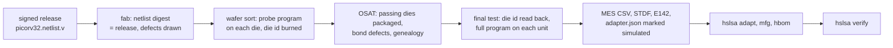

# Simulated hardware: the virtual shuttle and the simulated mark

Phase 2 of the [roadmap](roadmap.md) asks for records made from real silicon and real hardware: an open-PDK shuttle tapeout, the packaging and test data it returns, and a real board. Those need money, a shuttle slot and months of waiting. Until then, this page describes the software stand-ins: what they simulate, how a buyer tells their records apart from real ones, and what they prove.

Spec section: [Records from simulated hardware](../spec/hslsa-v0.1.md#records-from-simulated-hardware) (revision 15).

## What simulation proves, and what it cannot

A simulated lot exercises everything except the physics. It proves that:

- the record shapes, the adapters and the buyer's checks work on data that comes out of a running design, with its yield, its failures and its test escapes, rather than on numbers someone typed into a scenario;
- what the testers export (STDF, SEMI E142 maps, MES lot histories, a genealogy) is enough to make every F1 to F4 record, and the verifier can read those exports again and match them to the records;
- a tester can bind a serial to its die electrically: final test reads each unit's die id back from its fuses, and catches two dies put in each other's packages;
- the whole run is reproducible: the same release, configuration and seed give the same exports byte for byte, so anyone can run it again and compare.

It cannot prove anything about real parts:

- No wafer, die, package or board exists. A defect is a stuck-at fault on a net of the netlist, chosen by a seeded generator, not a particle or a misaligned mask. Real defects (bridges, opens, delay faults, parametric drift, leakage) behave differently, and real yields are not these.
- The netlist is Yosys's generic gates, not SKY130 standard cells after place and route, so nothing here checks timing, power or the GDS.
- No supplier's systems took part. A real fab's or OSAT's export can differ from what the shuttle writes, which is why the adapters' exit criteria still need a real export.
- A record's signature still proves only who made the claim. The simulator knows which shipped units are defective (see [the report](#what-only-the-simulator-knows)); the records cannot, and neither could a real lot's.

## The simulated mark

Every record the reference tool makes from simulated hardware says so in its hardware block:

```json
"hwMfg": {
  "step": "final-test",
  "simulated": {
    "simulator": "https://github.com/Horiodino/hw-slsa/tools/hslsa/sim/shuttle@v0.1",
    "standsIn": "an open-PDK shuttle: the wafer fab, sort house, OSAT and test house, and the dies they made; ...",
    "config": {"name": "shuttle.json", "digest": {"sha256": "..."}},
    "seed": "hslsa-virtual-shuttle-2026-10-lot-a",
    "design": {"name": "picorv32.netlist.v", "digest": {"sha256": "..."}},
    "rerun": "hslsa sim shuttle with the same release, configuration and seed writes the same exports byte for byte"
  },
  ...
}
```

`simulator` and `standsIn` are required; the rest is whatever lets someone run the simulation again. Provisioning records carry the same block in `hwProvision.simulated`.

The verifier refuses any lot, board or device whose records carry the mark, unless the buyer's policy says otherwise:

```json
"simulated": {"accept": true}
```

When it accepts one, it lists the simulated records, and every VSA it signs over them states `HSLSA_SIMULATED` next to the levels, so someone holding only the VSA (or checking it with slsa-verifier) sees it too. A VSA that states `HSLSA_SIMULATED` is refused under a policy that does not accept simulated evidence, wherever a VSA is read: the EMS's chip receipt in the board check, and the auditor's VSAs in [verifier escrow](selective-disclosure.md).

All the examples' manufacturing is simulated, so their policies set `simulated.accept`, and every lot, board and device VSA they sign states `HSLSA_SIMULATED`. The design VSAs do not: the design flows really ran. The [pilot kit's](../pilot/README.md) buyer policy, [`e2e/pilot/policy.json`](../e2e/pilot/policy.json), does not accept simulated evidence; its rehearsal runs under a copy that does, and checks that the real policy refuses the rehearsal's lot.

| Example | What is simulated | `simulator` |
| --- | --- | --- |
| [PicoRV32](e2e-test.md), its proxy and HSM runs | The fab, sort, packaging and test data | hand-written scenario |
| [MES and STDF adapter](mes-stdf-adapter.md), pilot rehearsal | The suppliers' exports | sample exports written by the adapter's tests |
| Virtual shuttle (this page) | Fab, sort, packaging and test, from the netlist | `.../tools/hslsa/sim/shuttle@v0.1` |
| [Board](board-example.md) | Shipments (typed in, or read from sample shipper exports by the [distributor importer](distributor-importer.md)) and the EMS line | hand-written scenario |
| [FPGA board](fpga-board-example.md) | The EMS line, the board, the EXR-01 root of trust and its programming station, and the after-sale sites (field updater, returns site, repair site) | hand-written scenario, the board and RoT models, the simulated XG-8 station |
| [Caliptra](caliptra-e2e.md) | The lot, and each unit's silicon during provisioning (the emulator, or the Verilated RTL) | hand-written scenario and the caliptra-sw hardware model |

The mark is the signer's own statement, like every other field. A record without it is not thereby proven to come from real equipment; the mark exists so that the tool cannot produce simulated records that look like real ones, for example when a supplier rehearses the pilot with its real, enrolled key.

## The virtual shuttle

`hslsa sim shuttle` takes the PicoRV32 example's release and "fabricates" it. Everything it reports comes from simulating the released netlist.



1. **Wafer fab.** The fab checks that the netlist in the bundle is the one the tapeout authority released (the stand-in for the mask-vs-GDS XOR; its MES row carries the released digest) and refuses anything else. It places the netlist on every die of a wafer grid (two wafers of 6 by 6 in the example) and draws each die's defects from a seeded generator: a Poisson number of stuck-at-0 or stuck-at-1 faults, each on one of the netlist's 6,117 internal nets.
2. **Wafer sort.** A probe program (an ALU, load/store and branch loop of 971 cycles) runs on every die in Icarus Verilog, with that die's faults forced on its nets. The expected signature comes from running the same program on the RTL, and the fault-free netlist must give the same one, or the shuttle stops. A die passes when it finishes with that signature; one that never finishes within twice the good die's cycles has hung. The tester burns each passing die's id (a byte of the lot, the wafer, x and y) into its fuse bank.
3. **Packaging.** The OSAT packages passing dies in map order (48 units here) and records the genealogy. A few units get a bond defect: one pin of the memory bus stuck. The configuration can also swap two dies into each other's packages (`labelSwaps`), an OSAT mistake the genealogy does not show.
4. **Final test.** A longer program (6,103 cycles, every RV32I instruction class: shifts, compares, byte and halfword loads and stores, calls, all branch kinds) runs on each unit's die with its faults and its pin defect. It first reads the die id from the fuses, and the tester requires the id the genealogy says this serial carries, then the RTL's signature.

The programs are written in Go with a small RV32I assembler ([`tools/hslsa/rv32.go`](../tools/hslsa/rv32.go)), so they can be read as code. Every die runs in parallel on the machine's cores; the example lot takes about 80 seconds on a 4-core runner.

The results go out as the files each site would export, in the formats the [MES and STDF adapter](mes-stdf-adapter.md) reads unchanged:

| File | From | Holds |
| --- | --- | --- |
| `fab-mes-lot-history.csv` | Fab MES | Lot start (wafers, mask set, process), the XOR against the release, process steps, ship |
| `sort-LOT-SIM-A.stdf` | Sort tester | STDF V4: a PTR per test and a PRR per die, with bin and coordinates |
| `sort-LOT-SIM-A-W01.xml`, `-W02.xml` | Sort house | SEMI E142 wafer maps with the same bins |
| `osat-mes-lot-history.csv`, `osat-mes-genealogy.csv` | OSAT MES | Receive, assembly operations, ship; serial to wafer, x and y |
| `ft-ASM-SIM-01.stdf` | Final test tester | STDF V4: die id readback, signature, cycles, bin per serial |
| `adapter.json` | The shuttle | The adapter configuration, with the `simulated` block |
| `report.json` | The shuttle | What only the simulator knows (below); not an export, and no record names it |

Bins: 1 pass, 5 wrong signature, 6 hang, 8 wrong die id.

### The example lot

`e2e/shuttle/shuttle.json`, seed `hslsa-virtual-shuttle-2026-10-lot-a`:

| | |
| --- | --- |
| Dies | 72 on two wafers; 20 drew a defect (21 faults) |
| Wafer sort | 60 passed; 7 gave a wrong signature, 5 hung |
| Packaged | 48 units; 4 got a bond defect; units 30 and 31 swapped dies |
| Final test | 41 passed; 3 hung, 1 wrong signature, 3 read another die's id (the swapped pair, and a bond defect on bit 0 of the bus) |
| Shipped lot | 41 units, Wafer and Package/Test L2 verified, every record checked against its export, every lot VSA stating `HSLSA_SIMULATED` |

### What only the simulator knows

`report.json` lists each die's defects and what became of it. In the example, 6 of the 41 shipped units carry a stuck-at fault that neither program detected. Some of those faults sit on logic the programs never exercise, and some may be on nets that cannot change any output; the report does not tell them apart. Either way, the lot's records are complete, correctly signed and agree with every export, and they still cannot show those 6 units: a record says what the testers saw. This is the [threat model's](../spec/hslsa-v0.1.md#what-a-signed-record-proves) point, made with numbers.

## Running it

After `e2e/run.sh produce` (Yosys and Icarus Verilog installed):

```sh
e2e/run.sh shuttle
```

It copies the produced bundle, runs the shuttle into `out/shuttle/exports`, adapts the exports, signs the lot with the example's site keys, checks it under [`e2e/shuttle/policy.json`](../e2e/shuttle/policy.json), and checks that the same policy without `simulated.accept` refuses it. By hand:

```sh
hslsa sim shuttle --bundle out/bundle --lock e2e/picorv32/inputs.lock.json \
  --config e2e/shuttle/shuttle.json --out out/shuttle/exports
hslsa adapt --config out/shuttle/exports/adapter.json --out out/shuttle/scenario.json
```

CI runs it in the produce job of the [HSLSA end-to-end workflow](../.github/workflows/hslsa-e2e.yml), uploads the exports as `hslsa-shuttle-exports`, and runs the shuttle tests (`go test -run 'RV32|Shuttle'`): the same small lot twice with identical exports, a lot whose only fault is two swapped dies caught at final test, and a netlist changed after tapeout refused by the fab.

## What is still open

The roadmap keeps the real items open: a shuttle tapeout, the packaging and test data it returns, a real board build and a real board boot. Events after the first buyer (roadmap phase 2 item 6) run on the simulated FPGA board since spec revision 18: a field firmware update, a return, a rework and a reshipment ([after-sale records](fpga-board-example.md#after-sale-records)). Things the simulation could do next, none started:

- gate-level simulation of the OpenLane 2 netlist in SKY130 standard cells, so the shuttle fabricates the design whose GDS was signed;
- a die identity rooted in hardware (a DICE key on the die instead of a burned id), to exercise Package/Test L3.
