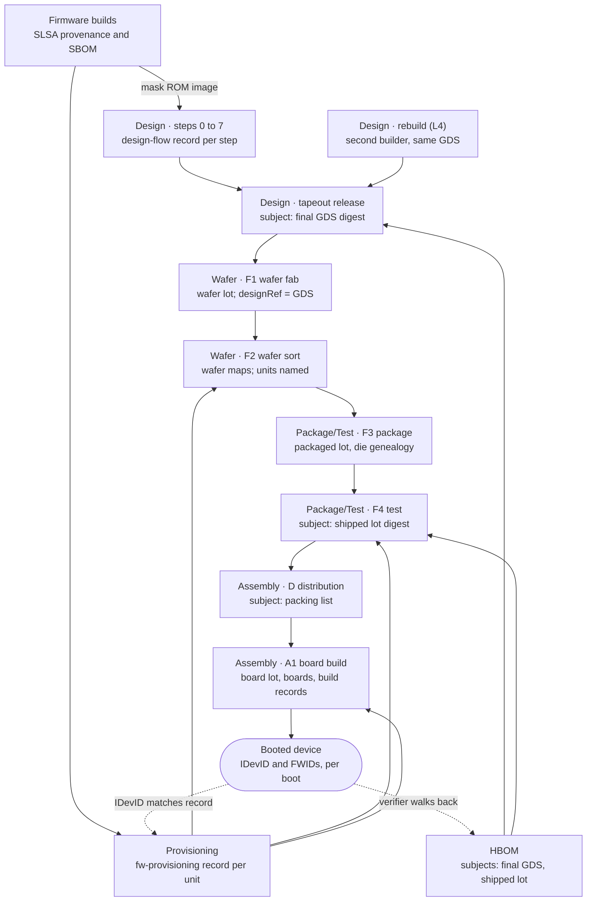

# Hardware Supply Chain Security Framework v0.1

**Status:** working draft, version 0.1, revision 3 (2026-09-13). See the [changelog](#changelog).

## Overview

HSLSA is a framework for proving how a chip or board was made, the way SLSA, SBOMs and in-toto do for software. It has three parts: a level scheme a buyer can ask for, one chain of signed attestations from RTL to a booted device, and a hardware bill of materials (HBOM) that ties the chain to the product.

This is version 0.1, a working draft. It consolidates the project's earlier drafts (the unified level scheme, a standards gap analysis, design provenance for RTL-to-GDS flows, fabrication and assembly attestations, firmware attestations, and the HBOM schema) into one text, and supersedes them where they disagree. Revision 2 writes in what the four [worked examples](#worked-examples-and-reference-implementation) needed: records for board parts, per-tool design steps, rebuilds and provisioning, and the checks a buyer runs on a board and on a booted device. Where the spec and the examples differ, the spec now matches what the examples, the HBOM schema and the reference tool do.

**Scope.** Digital ASIC and SoC design from RTL to GDSII, mask making, wafer fabrication and sort, packaging and final test, board assembly, and all firmware that ships in the part or on the board, through to the device proving what it booted. The full chain, down to the at-boot check, applies to parts with a hardware identity. Every other part on a board gets a distribution record and lot-level naming, which cannot detect one part swapped for another inside a lot. Out of scope for 0.1: distribution after the first buyer, the internals of secure boot and update protocols, and firmware for off-chip components (their vendors attest it, and it enters here as a dependency). Whether analog and mixed-signal flows can reach Design L3 is an open question.

**What the records prove.** A signed record proves which party made a claim and that nobody changed it afterwards, not that the claim is physically true. Levels L1 to L3 make the records tamper-evident and their signers accountable; only the L4 defense profile examines physical parts, and only a sample of them. The [threat model](#threat-model) says, track by track, which attacks each level stops and which it only makes accountable.

**Conventions.** MUST, SHOULD and MAY carry their RFC 2119 meaning in requirement tables. Every predicate and schema URI lives under `https://github.com/Horiodino/hw-slsa/`, the repository that hosts this spec. URIs are identifiers and need not resolve; a custom domain can replace this prefix in a later version.

## Terminology

These terms mean the same thing in every section and every predicate.

| Term | Meaning |
| --- | --- |
| Track | One stage of the supply chain rated on its own: Design, Wafer, Package/Test, Assembly or Firmware. A product states one level per track. |
| Level | What a buyer can verify about a track: L0 (no claim) to L3 in the core, plus an optional L4 defense profile. Levels are cumulative within a track. |
| Step | One attested unit of work, run by one party: a design flow step (0 to 7, plus 6a ROM merge), a rebuild, a manufacturing step (F1 to F4, A1), a distribution (D), an inspection (X), a firmware build, or a provisioning pass. |
| Site | The organization and physical location that runs a manufacturing or provisioning step, identified by its site key. |
| Subject | What an attestation is about. Files are named by digest; physical things are named by a URN plus the digest of a canonical list that defines them. |
| Wafer lot | The wafers a fab started together. Subject of F1. |
| Packaged lot | Every unit that left the package line. Subject of F3. |
| Shipped lot | The units that passed final test. Subject of F4 and the lot subject of the HBOM; its digest is the lot digest. |
| Unit | One packaged part. Named by serial at Package/Test L2, and by the digest of its device identity certificate at L3. |
| Shipment | Parts one party ships to another, described by a packing list (manufacturer, part number, lot, date code, quantity, and serials where the part has them). Subject of a distribution record. |
| Board lot | The boards from one A1 build that passed test. Named and digested like a shipped lot, with board serials as the unit identifiers. |
| Device identity | A per-unit key rooted in hardware (DICE or Caliptra class), provisioned at sort or final test and endorsed by a CA. At L3 it is the unit's name in every attestation. |
| Release attestation | The tapeout authority's signed statement over the final GDS. Every manufacturing step points at it through `designRef`. |
| Provisioning | Writing images, fuses and keys into a part at a fab, OSAT or board line. It is Firmware work, recorded in `fw-provisioning`. |
| HBOM | The signed hardware bill of materials for a product: an in-toto statement whose subjects are the design (the GDS for a chip, the board design for a board) and the lot (the shipped lot or the board lot). |
| Rebuild | A second build of a released design from the same inputs, compared against the first. Recorded in a `rebuild` record; evidence for Design L4. |
| Hierarchy level | The HBOM's `product.level` field (die, package, module, board, system). It says what kind of product this is, not how assured it is. |
| Defense profile | The optional L4 requirements: a second, independent party reaches the same result as the first. |

## Tracks and levels

A product is rated per track, never overall: for example Design L3, Wafer L3, Package/Test L2, Assembly L1, Firmware L2. Each level is defined by what a buyer can verify, and a track's level is the lowest level all of its steps reach.

| Track | Covers | Who runs it | Steps |
| --- | --- | --- | --- |
| Design | RTL, IP, PDK, EDA flow to GDSII, mask ROM contents | Design house | 0 to 7, plus 6a ROM merge |
| Wafer | Mask making, wafer fabrication, wafer sort | Foundry, mask shop, sort house | F1, F2 |
| Package/Test | Packaging, final test | OSAT, test house | F3, F4 |
| Assembly | Part shipments to the assembler, PCB, board and system build | Distributors, EMS or contract manufacturer | D, A1 |
| Firmware | Boot ROM, device and board firmware, provisioning | Firmware team, programming stations at fab, OSAT and EMS | Image builds, provisioning passes |

Wafer and Package/Test are separate tracks because foundry and OSAT are usually different companies, and one rating hid the weaker of them.

| Level | Name | What the buyer can verify | Status |
| --- | --- | --- | --- |
| L0 | No claim | Nothing | Core |
| L1 | Provenance exists | A complete record of how the item was made, in a standard format | Core |
| L2 | Signed by the producer | The record was produced and signed by a controlled platform or site, not typed by hand | Core |
| L3 | Hardened | Signing keys and build steps are isolated, inputs are pinned, and the subject is rooted in a hardware identity | Core |
| L4 | Independently verified | A second, independent party rebuilt or physically inspected the item and got the same answer | Optional defense profile |

Claims are written as track plus level, such as `Design L3`. An L4 claim is written `Design L4 (defense profile)` and requires L3 in the same track; tooling that checks only the core reads it as L3. A level says how far a buyer can rely on the records, not that the parts are free of tampering: Wafer L3 does not mean "no trojans". See the [threat model](#threat-model).

### Core requirements

Each cell adds to the one on its left.

| Track | L1: Provenance exists | L2: Signed by the producer | L3: Hardened |
| --- | --- | --- | --- |
| Design | Every flow step emits a `design-flow` attestation (tools, PDK, parameters, subject digests) and the chain from GDS back to RTL is complete; the release record lists IP blocks and versions and the GDS digest; an HBOM is published | Steps run on a managed flow platform, not a workstation, and the platform identity signs each attestation; source freeze is a signed, reviewed tag; waivers are signed by a signoff owner; third-party IP arrives with signed provenance | Steps are isolated from each other and from the network, except that a step MAY reach declared license servers ([Network access and licensed tools](#network-access-and-licensed-tools)); tools and PDK are pinned by digest and on an allow-list (a container image digest and a [PDK tree digest](#pinning-tools-and-pdks) count as pins); signing keys are unreachable from step code; formal equivalence between RTL and final netlist is recorded, and enough is attested for an independent party to rerun equivalence and LVS |
| Wafer | Lot record names the fab, mask set revision, GDS digest and probe program version | Each step signs with a site key; wafer fab names the wafer lot as subject; from sort onward, records name each unit | Keys held in HSMs at accredited sites (for example DMEA or O-TTPS); the fab verifies the design release attestation before mask making and records the mask-vs-GDS XOR; identities provisioned at sort are rooted in an on-die RoT (DICE or Caliptra class) and issued by an HSM-backed CA |
| Package/Test | Record names the OSAT, assembly lot and test program version for each lot | Each step signs with a site key; records name each unit, with genealogy to wafer and die position; every unit has a unique identity by final test; final test signs the shipped lot digest | Keys held in HSMs at accredited sites; every unit answers an identity challenge at final test, rooted in hardware; the shipped lot digest covers the units' certificate digests |
| Assembly | Board HBOM with lot and date code for every part, plus IPC-1782 style build records per serial number | Each assembly step signs its record against the board serial and the identities of its key components; every part lot arrives with a [distribution record](#distribution-record) signed by its shipper, and the assembler runs the lot receipt check on each chip before placement; a part without a hardware identity is named only by lot and date code, which cannot detect a swap inside a lot | Signing at accredited sites; every component with a hardware identity is checked by attestation at build; a platform certificate binds the system to those parts; parts without an identity stay at lot-level naming, as at L2 |
| Firmware | SLSA Build L1 provenance and an SBOM for every image; mask ROM content is proven by the Design track's ROM merge step | SLSA Build L2; images are signed and verified before the SoC runs them, by a secure-boot ROM on the silicon or by an attested board-level root of trust (proposed); a part with neither stops at Firmware L1 | SLSA Build L3; firmware is independently reviewed (S.A.F.E. style); releases appear in a transparency log; the device reports firmware measurements under a DICE or Caliptra class identity, and they match the attested image digests |

Three rules apply across tracks:

1. **Transparency logs may be private.** Every L3 log requirement is met by a private log (a private Rekor instance, or an RFC 9162 style log run by the buyer or a consortium), since no foundry will publish lot IDs or yields.
2. **Provisioning is Firmware, rated by its site.** Firmware Ln needs every provisioning site rated at least Ln in its own track (Wafer, Package/Test or Assembly).
3. **One check for the buyer.** At every level the buyer collects the attestations, confirms each subject matches the identity the device proves at boot, and compares the stated levels against policy. From Design L3, the tapeout check also requires the equivalence record.

**Firmware L2 through a board-level root of trust (proposed resolution).** A part without a secure-boot ROM MAY reach Firmware L2 on a board whose root of trust verifies the external flash, but only when that root of trust is itself attested (its own HBOM entry, Firmware provenance and provisioning record at L2 or higher) and it verifies each image before the SoC is released from reset. The claim is made for the board, not the bare part. This answers the open question in the level scheme and still needs the owner's sign-off.

### L4 defense profile

L4 is opt-in because its costs (a second builder, destructive part sampling) only make sense for root-of-trust, secure-element and defense parts.

| Track | L4 requirement (on top of L3) | Stops |
| --- | --- | --- |
| Design | A second, independently operated builder rebuilds from the same source and inputs and reaches a bit-exact or equivalent result, including the ROM macro, and signs a [`rebuild` record](#rebuild-record); two-person review on source freeze and waivers; tapeout release signed with an HSM key | A compromised flow platform or an insider on one builder |
| Wafer | Named regions of sampled die are delayered, imaged and compared against the signed GDS by an independent lab | Layout-level trojans and mask substitution at the foundry |
| Package/Test | Sampled units are decapsulated and X-rayed by an independent lab, and each die is matched to its genealogy and the signed GDS | Die swapped or remarked at the OSAT |
| Assembly | Sampled boards are X-rayed and components authenticated (SAE AS6171 style) by an independent lab, checked against the board HBOM | Counterfeit or substituted components that pass electrical test |
| Firmware | An independent party reproduces each image built from source bit for bit; two-person review on releases; per-unit data is covered by provisioning readback instead; a closed vendor binary caps the product at Firmware L3 unless its vendor supplies an independent rebuild | A compromised firmware build system or insider |

Wafer and Package/Test samples are drawn from the shipped lot after final test, so one inspection can serve both tracks. The lab commits to a random seed before the lot is sealed, states the lot size and sampling plan, names the regions and layers it imaged and the technique it used, and signs under a trust root separate from the producer's. What sampling and imaging can and cannot find is under [Limits of physical inspection](#limits-of-physical-inspection).

**SLSA and DoD alignment.** Design Ln and Firmware Ln each meet SLSA Build Ln for n from 1 to 3. From L2, Firmware adds device and review requirements SLSA does not have, so tooling must not treat the two as equal. How HSLSA lines up with DoD Microelectronics Levels of Assurance is inferred, not established: L3 in all tracks may approach LoA2, and the L4 profile may approach LoA3.

## Attestation model

Every record in HSLSA is an [in-toto Statement v1](https://github.com/in-toto/attestation/blob/main/spec/v1/statement.md) in a DSSE envelope. The step predicates are strict supersets of SLSA Provenance v1: `buildDefinition` and `runDetails` keep their SLSA meaning, and hardware fields sit in one extra block, so an unmodified SLSA verifier can check signer, subjects and inputs.

### Predicate types

| Predicate | URI | Extra block | Emitted by | Subject |
| --- | --- | --- | --- | --- |
| Design flow step | `https://github.com/Horiodino/hw-slsa/design-flow/v0.1` | `hwFlow` | Flow platform, per step and once as a run summary | Output files of the step; the final GDS for the summary |
| Tapeout release | `https://github.com/Horiodino/hw-slsa/design-flow/v0.1`, buildType `.../design-flow/step/release@v1` | `hwFlow` | Tapeout authority | Final GDS |
| Source review | `https://github.com/Horiodino/hw-slsa/source-review/v0.1` | none | Reviewer, who is not the commit's author | The reviewed commit (`gitCommit` digest) |
| Third-party IP release | `https://slsa.dev/provenance/v1` (unchanged), buildType `.../ip-release@v1` or the vendor's own | none | IP vendor | The released IP files |
| Rebuild (L4) | `https://github.com/Horiodino/hw-slsa/design-flow/v0.1`, buildType `.../design-flow/step/rebuild@v1` | `hwFlow` | Second builder | Final GDS of the release it rebuilt |
| Manufacturing step | `https://github.com/Horiodino/hw-slsa/manufacturing-step/v0.1` | `hwMfg` | Fab, sort, OSAT, test and EMS sites | Wafer lot, packaged lot, shipped lot, or board lot and boards |
| Distribution | `https://github.com/Horiodino/hw-slsa/manufacturing-step/v0.1`, buildType `.../mfg/step/distribution@v1` | `hwMfg` | The shipper: a distributor, or a manufacturer shipping direct | The shipment's packing list |
| Physical inspection (L4) | `https://github.com/Horiodino/hw-slsa/physical-inspection/v0.1` | none | Independent lab | Shipped lot and each sampled unit or board |
| Firmware image build | `https://slsa.dev/provenance/v1` (unchanged), buildType named for the builder (for example `.../firmware/caliptra-builder@v1`) | none | Firmware build platform | Image digest |
| Firmware provisioning | `https://github.com/Horiodino/hw-slsa/fw-provisioning/v0.1`, buildType `.../fw-provisioning/step/provision@v1` | `hwProvision` | Programming station at fab, OSAT or EMS | Each unit written |
| Firmware review | `https://github.com/Horiodino/hw-slsa/fw-review/v0.1`, wrapping an OCP S.A.F.E. report | none | Review provider | Image digest |
| HBOM | `https://github.com/Horiodino/hw-slsa/hbom/v0.1` | none | Product owner | Design (final GDS or board design) and lot (shipped lot or board lot) |
| Verification summary | `https://slsa.dev/verification_summary/v1` | none | Vendor or buyer verifier | Any subject above |

Step types are named `https://github.com/Horiodino/hw-slsa/design-flow/step/<step>@v1` and `https://github.com/Horiodino/hw-slsa/mfg/step/<step>@v1`. A flow platform MAY instead name the tool that ran the step, as in `.../design-flow/step/openlane2@v1`, when it also states the spec step in `hwFlow.step` (see [Per-tool design steps](#per-tool-design-steps)). A verification summary reports levels as `HSLSA_<TRACK>_LEVEL_<n>` (for example `HSLSA_WAFER_LEVEL_3`); SLSA allows custom `verifiedLevels` values that do not start with `SLSA_`.

### Naming subjects

Files are named by sha256 (sha384 where a device reports SHA-384 measurements, as Caliptra does). Physical things have no file digest, so each one is a URN plus the digest of the canonical list that defines it. All physical names use one URN prefix, `urn:hslsa:`.

| Thing | Name | Digest over |
| --- | --- | --- |
| Wafer lot | `urn:hslsa:wafer-lot:<fab-id>:<lot-id>` | Its sorted wafer IDs |
| Wafer map | The map file (SEMI E142 or the foundry's format) | File digest |
| Packaged lot | `urn:hslsa:assembly-lot:<lot-id>` | Every unit that left the package line |
| Shipped lot | `urn:hslsa:lot:<lot-id>` | The lot digest (below) |
| Unit | `urn:hslsa:unit:<serial>` | In the lot: the serial at Package/Test L2, the DER identity certificate at L3. As the subject of a record about one device, see below |
| Shipment | The packing list file | File digest |
| Board lot | `urn:hslsa:lot:<board-lot-id>` | The lot digest (below), over the serials of the boards that passed test |
| Board | `urn:hslsa:board:<manufacturer>:<serial>` | The DER identity certificate once the board has one; until then the serial itself, as UTF-8 bytes with no trailing newline |

`<manufacturer>` in a board URN is the manufacturer's name in lowercase with spaces replaced by hyphens.

A record about one device names it by its strongest identity, whatever level the lot claims:

- A `fw-provisioning` record for a unit with a device identity uses the sha256 of its IDevID public key (the DER SubjectPublicKeyInfo) as the digest, because the station signs before the certificate is used and the key is what the device proves at boot.
- A verification summary for a booted unit (a unit VSA) uses the sha256 of its DER IDevID certificate when the unit has a device identity, and the serial otherwise. The Caliptra example does this while its lot is still named by serials at Package/Test L2.

### Lot digest

The shipped lot digest is the single binding between the HBOM and the physical units. It is computed the same way wherever it appears (F4, the HBOM, inspection records):

```math
\mathrm{lotDigest} = \mathrm{SHA256}\big(\mathrm{join}(\mathrm{sort}(u_1, \dots, u_n), \texttt{\textbackslash n}) \,\|\, \texttt{\textbackslash n}\big)
```

Each unit identifier is the serial (Package/Test L2) or the lowercase hex sha256 of the unit's identity certificate in DER (Package/Test L3), sorted as byte strings, joined with newlines and ending in one newline. Yield loss changes the lot between packaging and shipment, so F3 names the packaged lot and F4 names the shipped lot; the verifier checks that shipped units are a subset of packaged ones and that F4's yield record accounts for the rest.

### Signing and keys

Platforms and sites sign step records; people sign only decisions.

| Signer | Signs | Key model |
| --- | --- | --- |
| Design flow platform | Every design step and the run summary | Sigstore keyless (OIDC workload identity to Fulcio), a private Sigstore, or an HSM-held or local key for air-gapped or private flows |
| Second builder (L4) | `rebuild` records | Its own key, under a trust root separate from the first builder's |
| Design engineer | Source freeze tag, ECO attestations | Personal key, or keyless with corporate SSO |
| Signoff owner | Waivers, signoff approval | Hardware token (FIDO2 or smart card) |
| Tapeout authority | Release attestation over the GDS | Offline or HSM-held key |
| IP and PDK vendors | Their own deliverables | Vendor key in a trust root (open question) |
| Distributor, or a manufacturer shipping direct | Distribution records for the shipments it sends | Its own site key; the buyer's policy lists which shippers are authorized channels for which manufacturers |
| Foundry, sort, OSAT, test and EMS sites | Every manufacturing step | X.509 site key, in an HSM from L3; the certificate names the site and its accreditation |
| Process or quality engineer | Deviations, rework orders, bin-limit waivers | Hardware token |
| Identity provisioning CA | Unit identity certificates | HSM-held CA key per product line |
| Firmware build platform | Image provenance and SBOM | As for the design flow platform |
| Programming station | `fw-provisioning` records | The site key of the site it sits in |
| Independent lab (L4) | Inspection records | Lab's own key under a trust root separate from the producer's |

None of these key models requires a public transparency log. The reference tool signs every record as a DSSE envelope with a local ECDSA P-256 key, publishes nothing, and hands the buyer a trust root of public keys by role; that meets every requirement up to L2, and L3 logs may be private (see the rules under [Core requirements](#core-requirements)).

### Rules every step follows

1. **Decisions are inputs.** Waivers, process deviations, rework orders and bin-limit waivers are `externalParameters` with their own digest and signer.
2. **Edits and rework are steps.** An ECO, manual layout fix, reworked wafer or re-marked package gets its own attestation; anything that re-enters the chain without one breaks it on purpose.
3. **Nothing disappears silently.** Scrap is recorded in the yield block, so a lot cannot gain or swap units unnoticed.
4. **Confidential values are digests.** A field a supplier will not disclose (recipe, yield, fab site, wafer IDs, third-party IP) is replaced by a salted digest and listed by JSON Pointer (`hwMfg.confidential[]` in step records, `redactions[]` in the HBOM). An auditor given the salt can confirm the value.
5. **Third-party inputs are dependencies.** Hard IP, cell libraries, PDKs and vendor firmware are pinned by digest in `resolvedDependencies`, with the vendor's own attestation linked when one exists.

### Record shapes

The examples needed four record shapes the drafts left open, and commercial flows need one more, for network access. Each is still an in-toto Statement whose predicate is a superset of SLSA Provenance v1.

#### Pinning tools and PDKs

A tool MAY be pinned by the digest of the container image it runs in, as a `resolvedDependencies` entry with a `docker://` URI and the image's index digest; the step then lists each tool binary it used with its digest inside that image in `hwFlow.tools`. A PDK or any other directory tree MAY be pinned by one tree digest:

- Walk the tree from its root, directory by directory. In each directory take the entries that are files or symlinks, sorted by name, then descend into the subdirectories, sorted by name.
- Write one line per file, `F <path> <sha256>`, and one per symlink, `L <path> <target>`, where `<path>` is relative to the root with `/` separators.
- The tree digest is the sha256 of those lines joined with newlines, with no trailing newline.

Every step of one flow MUST name the same source, image and PDK digests, so a verifier can check that nothing changed mid-flow. The [OpenLane 2 example](../docs/openlane2-flow.md) pins the SKY130A variant this way.

#### Per-tool design steps

A flow tool usually runs many small steps for each spec step (OpenLane 2's Classic flow runs 74 for steps 1 to 7). A flow platform MAY sign one record per tool step, with buildType `.../design-flow/step/<tool>@v1`, as long as each record:

- states the spec step it belongs to in `hwFlow.step` (`simulation`, `synthesis`, `floorplan`, `place-cts`, `routing`, `signoff` or `gds-stream-out`), and the tool's own step name in a tool-specific field (`hwFlow.openlaneStep` with its `ordinal`);
- lists every input design view by digest, each an output of an earlier record, and the previous record itself;
- carries the step's resolved configuration by digest, and the metrics the step changed in `hwFlow.metrics`.

The verifier requires every spec step from synthesis to stream-out to be covered by at least one record, the records to be linked in order, and the released GDS to be a subject of the last stream-out record. The mapping from OpenLane 2 step names to spec steps is in [`tools/hslsa/openlane.go`](../tools/hslsa/openlane.go).

#### Network access and licensed tools

Commercial EDA tools check out licenses from a license server while they run, so a step that runs one cannot be cut off from the network entirely, as Design L3 otherwise requires. A Design L3 step MAY therefore reach declared license servers and nothing else. A Design L3 step MUST record its network access in `hwFlow.network`, and any other design step MAY, with these fields:

| Field | Holds |
| --- | --- |
| `mode` | `isolated` (no network), `license-server` (the servers below and nothing else) or `open` (anything else). A step with no `network` block counts as `open` |
| `licenseServers[]` | Each server the step may reach: `address` as the tool is configured with it (`27000@lic1.flow.internal` for FlexNet), `daemon` (the vendor daemon, such as `snpslmd`), and `endpoints[]`, the `ip:port` pairs the platform allows |
| `features[]` | Each license feature checked out: `server` (a declared `address`), `name`, `version` and `count` |
| `featureSource` | Where `features[]` came from: `license-server-log` (the server's checkout log for this step's client) or `tool-log` |
| `observed[]` | Every outbound connection attempt the platform saw from the step: `endpoint`, `allowed`, `connections`, `bytesSent` and `bytesReceived` |

```json
"network": {
  "mode": "license-server",
  "licenseServers": [
    {"address": "27000@lic1.flow.internal", "daemon": "snpslmd", "endpoints": ["10.20.0.5:27000", "10.20.0.5:27010"]}
  ],
  "features": [
    {"server": "27000@lic1.flow.internal", "name": "Example-Synthesis", "version": "2025.06", "count": 1}
  ],
  "featureSource": "license-server-log",
  "observed": [
    {"endpoint": "10.20.0.5:27000", "allowed": true, "connections": 1, "bytesSent": 1830, "bytesReceived": 2210},
    {"endpoint": "10.20.0.5:27010", "allowed": true, "connections": 2, "bytesSent": 9120, "bytesReceived": 8870}
  ]
}
```

1. **The platform enforces it.** The flow platform sets the network policy outside the step (a network namespace or firewall that step code cannot change) and fills in `observed[]` from what it enforced. A tool's own report of its network use counts for nothing.
2. **Only declared endpoints.** The step can reach the declared endpoints and nothing else, including DNS: the platform resolves each server's address before the step starts and allows the resulting `ip:port` pairs. A FlexNet server needs two, the license manager's port and the vendor daemon's, so the vendor daemon's port has to be fixed (`PORT=` on the license file's `VENDOR` line); a daemon on a random port cannot be allowed by endpoint.
3. **The record agrees with itself.** Every allowed connection in `observed[]` went to a declared endpoint, and every checked-out feature came from a declared server. Blocked attempts are recorded with `allowed: false`; they do not fail the step, since the platform stopped them, but they show a buyer that a tool tried to reach somewhere else.
4. **The policy names the servers.** Every declared server and endpoint is on the tapeout policy's list. A policy SHOULD list only servers the design house runs on its own network; listing a tool vendor's cloud licensing service accepts that design data can reach that vendor.
5. **Features are configuration.** Which features a tool checks out can decide which engines and options it may use, so they belong to the step's effective configuration. A rebuild SHOULD check out the same features, and its `hwFlow.reproducibility` names any difference.

The license connection is still a way out of the step: a compromised tool can send design data to the server, and the server's replies reach the tool. This rule accepts that, and the server joins the flow platform's trust boundary. `bytesSent` lets a policy set a ceiling per step, which catches bulk copying but not a slow leak.

The reference tool's tapeout check applies rule 3 to every step that carries a `network` block. Its policy adds three settings under `design.network`: `requireIsolation` makes every required step `isolated` or `license-server`; `allowedLicenseServers[]`, each an `address` and its `endpoints`, is the list for rule 4, which also applies whenever isolation is required; and `maxBytesSent` is the ceiling on the bytes a step sent. No worked example runs its steps isolated yet, so the unit tests in [`tools/hslsa/network_test.go`](../tools/hslsa/network_test.go) and one tamper test on the PicoRV32 chain exercise the check.

#### Rebuild record

A `rebuild` record is a design-flow statement with buildType `.../design-flow/step/rebuild@v1`, signed by the second builder. Its subject is the released final GDS, it consumes the release attestation it rebuilt, and `hwFlow.checks` carries two results:

| Check | Passes when |
| --- | --- |
| `gds-bit-exact` | The second build's final GDS is byte-identical to the released one |
| `gds-equal-ignoring-timestamps` | The two are equal once the GDS BGNLIB and BGNSTR dates are cleared |

`hwFlow.reproducibility` MAY add a per-output comparison and the first step whose outputs differ in content. A Design L4 claim needs a rebuild record from an independently operated builder in which `gds-bit-exact` passes; a buyer's policy MAY accept `gds-equal-ignoring-timestamps` instead, and says so. The [OpenLane 2 example](../docs/openlane2-flow.md#reproducibility) signs a draft rebuild record from a second runner of the same operator, which is the right shape but not yet independent.

#### Distribution record

A distribution record is a manufacturing-step statement with buildType `.../mfg/step/distribution@v1`, signed by whoever ships a lot of parts to the assembler. Its subject is the shipment's packing list, by file digest. For a part that has its own chain, it consumes that part's shipped lot (the URN and lot digest), and the packing list names the serials shipped. `hwMfg.site` names the shipper, and `hwMfg.checks` carries at least `certificate-of-conformance` and `traceable-to-manufacturer`. The board HBOM points at it from `parts[].distributionRef`. See the [board example](../docs/board-example.md).

#### Firmware provisioning record

A `fw-provisioning` record is SLSA Provenance v1 with buildType `.../fw-provisioning/step/provision@v1` and one extra block, `hwProvision`:

| Field | Holds |
| --- | --- |
| `station`, `site` | The programming station and the site it sits in |
| `unit`, `lot` | `urn:hslsa:unit:<serial>` and the shipped lot it belongs to |
| `designRef` | The released design and its release attestation |
| `images[]` | Each image written: name, role, storage, digest, readback digest, and whether its provenance was verified before writing |
| `fuses` | Every fuse value burned, except secrets |
| `secrets[]` | Each secret by field, key id and origin (`generated-on-die`, or the injecting HSM), never its value |
| `identity` | For a part with a device identity: scheme, UEID, IDevID public key digest, the endorsed certificate by digest, and the endorsing CA |
| `checks[]` | At least `image-provenance-verified`, `image-readback` and `fuse-readback`; `lifecycle-production` where the part has a lifecycle state |

`resolvedDependencies` lists each image's provenance and the images, and for a part with an identity the exported CSR and the endorsed certificate. The subject is the unit, named as in [Naming subjects](#naming-subjects). The [Caliptra example](../docs/caliptra-e2e.md) signs one per unit.

## The attestation chain

A verifier holding a booted device can walk by digest alone from its identity certificate to the shipped lot, back through packaging and the wafer lot to the signed GDS, and from there to reviewed RTL and every tool and PDK used. Each step lists the previous step's subjects in `resolvedDependencies`, and every manufacturing step copies the GDS release into `hwMfg.designRef`.



Each arrow is a digest link. A board has its own HBOM, with the board design and board lot as subjects, that points at A1, at each distribution record and at each chip's HBOM. Firmware joins twice: mask ROM content through the Design flow, everything else through provisioning records. The dashed lines are the checks a verifier runs from a live device.

### Steps

| Step | Track | Consumes (by digest) | Produces (subject) | Key gates in `checks` |
| --- | --- | --- | --- | --- |
| 0. Source freeze | Design | RTL tree, testbenches, constraints, IP manifests; at L2 the signed tag's commit, its source review and each IP block's provenance | Source archive | At L2, signed tag, source review and IP provenance verified; two-person review at L4 |
| 1. Simulation and lint | Design | Source archive, testbenches, IP models | Coverage and log reports | Tests pass, coverage threshold |
| 2. Synthesis | Design | Source archive, liberty files | Gate-level netlist, SDC | Lint clean; netlist vs RTL equivalence |
| 3. Floorplan and power | Design | Netlist, SDC, tech and cell LEF | ODB/DEF | Macro placement check |
| 4. Placement and CTS | Design | Floorplan ODB | Placed ODB | Post-CTS timing |
| 5. Routing | Design | Placed ODB | Routed ODB/DEF, SPEF | Route DRC count = 0 |
| 6. Signoff | Design | Routed layout, SPEF, DRC and LVS decks | Timing, DRC, LVS reports | STA met, DRC clean, LVS match, waivers digest |
| 6a. ROM merge (mask ROM only) | Design, for Firmware | ROM image (by its SLSA provenance digest), ROM compiler, empty ROM macro | Programmed ROM macro GDS, merged layout | `rom-readback`: bits extracted from layout match the image digest; optional `rom-matches-frozen` (see [Mask ROM](#mask-rom)) |
| 7. GDS stream-out | Design | Routed layout, cell, IP and ROM macro GDS | Final GDSII/OASIS | GDS vs DEF XOR clean |
| Release | Design | Run summary over steps 0 to 7 | Final GDS | Tapeout policy check (below) |
| Rebuild (L4) | Design | Release attestation, the same pinned inputs | Final GDS of the release | `gds-bit-exact`, `gds-equal-ignoring-timestamps` |
| F1. Wafer fabrication | Wafer | GDS release, mask set record | Wafer lot | Mask data vs GDS XOR; inline parametrics |
| F2. Wafer sort | Wafer | F1, wafer lot | Wafer maps; unit identities if provisioned here | Probe pass; identity provisioning log |
| F3. Packaging | Package/Test | F2, wafer maps, package material certificates | Packaged lot, die-to-unit genealogy | Die attach, wire bond, X-ray sample, marking |
| F4. Final test | Package/Test | F3, packaged lot | Shipped lot, unit identities, STDF results | Final test per unit; identity challenge; yield within limits |
| Firmware build | Firmware | Firmware source and toolchain | Image and its SBOM | As for any SLSA build |
| Provisioning | Firmware | Images (after verifying their provenance), fuse map, key origins | Each unit written | Readback digest per image and fuse field |
| D. Distribution | Assembly | For a part with its own chain, its shipped lot | The shipment's packing list | Certificate of conformance; traceable to the manufacturer |
| A1. Board assembly | Assembly | Every distribution record, the HBOM and F4 record of each chip with its own chain, the chip shipped lots, the board design | Board lot, each board, the per-serial build records; platform certificate at L3 | Part lot receipt check; AOI, BGA X-ray, ICT, functional test; yield; component identity check at L3 |
| X. Inspection (L4) | Wafer, Package/Test or Assembly | Sampled units or boards, committed seed | Result over lot and sampled identities | Per-unit pass, fail or inconclusive |

The design steps stop at the signed GDS release; mask data preparation (OPC, fracturing) happens inside the foundry and is recorded in F1. On a multi-project wafer, F1 is issued once per customer design, so no customer sees another's GDS digest. Wafer lots and assembly lots are many-to-many, so F3 records (wafer lot, wafer, X, Y) for every unit.

### Mask ROM

A mask ROM is firmware by build and silicon by delivery, and nothing on the running device can check it, because it does the checking. Its trust therefore runs through the Design track: the image carries ordinary SLSA provenance, and step 6a proves with `rom-readback` that the layout holds exactly that image. Three rules follow. The ROM image's provenance must exist before step 6a, so ROM firmware reaches Firmware L1 no later than the chip reaches Design L1. ROM patches held in OTP are provisioned data, recorded in `fw-provisioning`. At Design L4 the independent rebuild must reproduce the ROM macro, which needs the image to rebuild bit for bit.

When a third party has published a digest for the ROM image (the Caliptra TAC's frozen-image list, for example), step 6a MAY also record `rom-matches-frozen`, which passes when the image built from source equals that published digest. It is an independent rebuild of the ROM image by the party that froze it, so it counts toward the Firmware L4 rebuild requirement for the ROM, but not toward Design L4, which is about the layout.

### Provisioning

The programming station is the firmware's last builder. For every part it writes it MUST verify each image's provenance before writing, read back every image and fuse field and record the readback digest, name secrets only by key id and origin (`generated-on-die`, or the injecting HSM), record the IDevID public key digest and endorsing CA for DICE or Caliptra parts, and sign with its site's key. The record's shape is defined under [Firmware provisioning record](#firmware-provisioning-record). One record MAY cover a lot programmed in one pass for a part without a device identity; a part with one gets a record per unit, whose subject is that unit's IDevID public key digest, because the at-boot check starts from it.

| Stage | Site | Typically written |
| --- | --- | --- |
| Wafer sort | Fab or test house | Identity seed (UDS), lifecycle state, trim and calibration fuses |
| Final test | OSAT | Remaining fuses, on-die flash images, IDevID CSR export for endorsement |
| Board assembly | EMS | External flash images, board-level keys, platform certificate inputs |

### Where the chain is checked

**At tapeout**, before the GDS leaves for the foundry:

1. The GDS digest matches the release attestation, signed by an allowed tapeout authority.
2. Every step from source freeze to stream-out is present, signed by an allowed builder, and linked by digest. With [per-tool records](#per-tool-design-steps), each spec step is covered by at least one record and every input view is an output of an earlier record.
3. Every tool and PDK digest (or the image and PDK tree digests that pin them) is on the approved list, and every step names the same ones.
4. Every required gate passed, every waiver is signed by a signoff owner, and a chip with a mask ROM passed `rom-readback`.
5. From Design L2, the source freeze consumes a tag signed by an allowed source owner and a source review of the same commit by someone other than its author, and the verifier walks git's object hashes from the tag to every file in the source archive. Every IP block the release lists has provenance signed by its vendor, and the IP files in the archive match it.
6. From Design L3, every step's `hwFlow.network` is `isolated` or `license-server`, every connection the platform allowed went to a declared endpoint, and every declared license server is on the policy's list (see [Network access and licensed tools](#network-access-and-licensed-tools)).
7. From Design L3, an equivalence record between RTL and final netlist exists; at Design L4, a [`rebuild` record](#rebuild-record) from an independent builder also exists and passes the check the policy asks for (`gds-bit-exact` by default).

**At lot receipt**, by the buyer, OEM or EMS:

1. The HBOM's lot subject equals the F4 shipped lot digest, and every received unit is in it (at L3, each unit answers a challenge with a certificate whose digest is in the lot).
2. F1 to F4 are all present, signed by allowed sites, and linked by digest.
3. Every step's `designRef` names the same GDS, and its release attestation verifies at the buyer's minimum Design level.
4. Genealogy is complete and yields reconcile from F2 to F4.
5. Every required gate passed and every deviation or rework is signed.
6. For an L4 claim, an inspection record from an allowed lab covers the lot, with an acceptable sampling plan and no failed sample.

Board assembly runs this same check on each part before placement, then adds A1, so a system integrator verifies the board and, through it, every part.

**At board receipt**, by the system integrator or board buyer:

1. The board HBOM is signed by the board owner and valid against the schema, and its lot subject is A1's board lot.
2. A1 is signed by an allowed EMS site, its gates passed, it names the same board design, and it consumes every distribution record and each chip's shipped lot and HBOM.
3. Every `parts[]` entry has a distribution record signed by a shipper the policy names, with the same lot and date code. `authorized: true` holds only where the policy lists that shipper as an authorized channel for the manufacturer, and the policy MAY require an authorized channel for every part.
4. Each chip with its own chain passes the lot receipt check above under its own trust root, every chip shipped to the EMS is in its shipped lot, and the board HBOM names the lot that chain proves.
5. `parts[]` covers exactly the board design's reference designators; every placement in the build records is a listed lot; no serialized part is placed twice or placed without being shipped, and no lot is placed more often than it was shipped.
6. The board lot is the set of boards that passed test, A1's yield accounts for the rest, every board in the lot is an A1 subject, and every received board is in the lot.

The [board example](../docs/board-example.md) runs these checks and breaks each one in its tamper tests.

**At boot**, on every unit with a device identity (required for a Firmware L3 claim, and available from Firmware L2):

1. Check the device's certificate chain to the identity CA in the trust root, as any DICE verifier does, and check that every certificate names the unit (its UEID) and that the unit is in the shipped lot.
2. Find the `fw-provisioning` record whose subject is the IDevID public key digest. It must be signed by an allowed station site, name this unit, this lot and this design release, and have all its gates passed; it gives the site, fuse state and images written.
3. For each FWID in the alias certificates (TCG DICE TcbInfo), find image provenance with that digest as subject, and check its level (and, for L3, review and log inclusion). Where the device also measures its fuses (Caliptra's vendor and owner fuse info, for example), recompute those measurements from the fuses the provisioning record says were burned; they must match what the device reports.
4. Confirm the HBOM's GDS has a Design chain whose ROM merge step consumed the ROM image named by its provenance and passed `rom-readback`; that is the only way the mask ROM, which took the first measurement, is covered. If the policy asks for it, `rom-matches-frozen` must also have passed.
5. Check that the SVN the device reports equals the image's SVN in its provenance, and that it is not below the anti-rollback fuse value in the provisioning record or the policy minimum.

A verifier that passes these steps MAY sign a unit VSA, whose subject is named as in [Naming subjects](#naming-subjects). The [Caliptra example](../docs/caliptra-e2e.md#the-at-boot-check) runs these five steps on emulated units at Firmware L2.

Policy can be written in existing in-toto tooling (layouts, witness policies or Rego), because the envelopes are standard.

## Hardware bill of materials

The HBOM is the one document a buyer starts from: it lists what the product is made of and who made each part, and points by digest at every attestation in the chain rather than copying them. It is required from Design L1.

**Format.** The HBOM is a CycloneDX 1.6 document at its core, with every extension also mapped to SPDX 3.1 so either can be emitted. SPDX 3.0 has no hardware profile; the mapping targets the SPDX 3.1 release candidate (Hardware classes `PhysicalHardware`, `BulkHardware`, `VirtualHardware`; SupplyChain classes `ManufactureProcess`, `AssemblyProcess`, `TestProcess`, `ResponsibilityChangeProcess`) and will be rechecked when 3.1 is final. New fields live in one `hbom:` namespace; in CycloneDX they travel as properties prefixed `hbom:`.

**Envelope and subjects.** The HBOM ships as the predicate of an in-toto Statement with predicate type `https://github.com/Horiodino/hw-slsa/hbom/v0.1` and two subjects:

1. **Design subject:** the final GDS, by sha256, for a die or package. Every part from this tapeout shares it. For a module, board or system it is the board design package (schematic, Gerbers, pick-and-place and BOM), by sha256.
2. **Lot subject:** `urn:hslsa:lot:<lot-id>` with the lot digest as its digest: the shipped lot from F4 for a die or package, the board lot from A1 for a module, board or system. A verifier holding one part or board checks its serial or identity certificate against that lot.

**Predicate.** What is required depends on the hierarchy level, so a shuttle chip or a small board with little data still validates; the rest fills in as a supplier climbs levels.

| `product.level` | Required |
| --- | --- |
| Any | `hbomVersion`, `product`, `manufacturing` |
| `die`, `package` | `manufacturing.fab` |
| `module`, `board`, `system` | `manufacturing.boardAssembly` and `parts[]`; no fab data, which lives in each part's own HBOM |

| Block | Holds | Points at |
| --- | --- | --- |
| `product` | Name, hierarchy level (die, package, module, board, system), part number, revision, manufacturer, purl, device identity scheme | Nothing |
| `renderings[]` | Full CycloneDX or SPDX documents for the same product | Each by digest |
| `design` | IP blocks (kind, supplier, license, IEEE 1735 flag), RTL sources by commit, PDK, flow steps and tools, final layout | Each flow step's `design-flow` attestation via `provenanceRef` |
| `manufacturing` | Foundry, process node, mask set, shuttle, wafer lots, OSAT and package, test stages and programs; for boards, the EMS and board lot in `boardAssembly` | F1 via `fab.attestationRef`, F3 via `assembly.attestationRef`, F2 and F4 results via `test[].resultsRef`, A1 via `boardAssembly.attestationRef` |
| `firmware[]` | Each image's name, role, storage (mask-rom, otp, on-die-flash, external-flash) and digest | Its SBOM via `sbomRef` |
| `parts[]` | For boards: reference designators, manufacturer, MPN, date code, lot, distributor, authorized channel | The part's own HBOM via `hbomRef`; the shipment via `distributionRef` |
| `redactions[]` | JSON Pointers to withheld fields and their salted digests | Nothing |

**Changes from the HBOM draft.** This spec makes these changes to the draft schema so it fits the rest of the chain:

1. The lot subject is renamed from `urn:hbom:lot:` to `urn:hslsa:lot:` and names the shipped lot, with the lot digest defined above (serials at Package/Test L2, certificate digests at L3).
2. The supplier slices the draft left undefined are the `manufacturing-step` records defined here: `fab.attestationRef` points at F1, `assembly.attestationRef` at F3, and `test[].resultsRef` at the F2 or F4 results that record signs.
3. `flowStep.step` gains `rom-merge` and `release`, so the HBOM can reference every Design step.
4. `product.level` keeps its name but is documented as the hierarchy level only; assurance levels are not stated in the HBOM (see open questions).
5. `manufacturing.fab` is required only for dies and packages; boards, modules and systems require `manufacturing.boardAssembly` and `parts[]` instead.
6. New `manufacturing.boardAssembly` block: `ems`, `boardLot`, and `attestationRef` to A1.
7. New `parts[].distributionRef`: the signed distribution record for that part's lot.

The JSON Schema and the worked examples are in this repository at [`hbom/hbom-predicate-v0.1.schema.json`](../hbom/hbom-predicate-v0.1.schema.json), [`hbom/picosoc-sky130.hbom.intoto.json`](../hbom/picosoc-sky130.hbom.intoto.json) and [`hbom/picosoc-devboard.hbom.intoto.json`](../hbom/picosoc-devboard.hbom.intoto.json), all current with these changes. [`hbom/picosoc-sky130.shipped-lot.txt`](../hbom/picosoc-sky130.shipped-lot.txt) and [`hbom/picosoc-devboard.board-lot.txt`](../hbom/picosoc-devboard.board-lot.txt) are their canonical unit and board lists, so both lot digests can be recomputed.

**Worked example.** The PicoRV32-based PicoSoC on SkyWater SKY130, packaged in QFN-64, uses serial identities, so it can claim at most Package/Test L2. Its test verifies Design L2: the flow platform signs every step, the source freeze is an SSH-signed git tag with a source review by someone other than the author, and PicoRV32 arrives with IP provenance signed by a key standing in for its vendor. It stops at Firmware L1: both images live in external SPI flash and the silicon has no secure-boot ROM, so a provisioning record for it would carry empty `fuses`, `secrets` and `identity` fields, showing a buyer that nothing in the part anchors the firmware. Under the proposed board-level root of trust rule, a board carrying it could reach Firmware L2; the example board has no root of trust, so it stays at Firmware L1.

## Threat model

This section says what a buyer can rely on at each level, and what no level gives them. Read it before writing a level into a purchasing policy.

### What a signed record proves

When a verifier accepts a record, it has learned three things: the holder of an allowed key signed it, nobody changed it afterwards, and it links by digest to the records around it. It has not learned that the record is true. A fab's F1 record shows that the fab claims it built the released GDS. It cannot show that nobody changed a mask.

Physical things differ from files in a way that shapes everything below. A file's name is its digest, so changing the file changes its name and breaks every link to it. A wafer, a unit or a board keeps its name when it is changed. The lot digest proves which units a site said were in a lot, not what is inside them: a modified part keeps its serial, and every record around it stays valid.

Records meet the physical part in three places only:

1. **Hardware identity.** At Package/Test L3 final test, at lot receipt for an L3 lot, and at boot, a unit proves it holds a private key rooted in its own die. A part without that key (a clone, a remarked part, a die that was never endorsed) fails. A genuine die in a tampered package passes, and so does a clone carrying a key extracted from a genuine die.
2. **The device's own measurements.** At boot the device reports what it ran and which fuses it read, measured by its mask ROM, and the [at-boot check](#where-the-chain-is-checked) compares them with the provisioning record and the image provenance. This tests the programming station's claims against the part itself, but only as far as the ROM can be trusted, which is why the ROM is proven through the Design track.
3. **L4 inspection.** An independent lab examines sampled parts. Nothing else in this spec looks at silicon, packages or boards.

Everything else in the chain is signed testimony. It makes the signer accountable for what it said, and makes any later change to what it said detectable.

### Three outcomes

For each attack in the tables below, HSLSA does one of three things:

- **Stops it.** A check fails before the design, lot or unit is used: one the buyer runs, or, for firmware, the device's own secure boot.
- **Makes it accountable.** The attack can succeed, but only if an allowed signer puts its key to a false statement. The record is then evidence against that signer, for a contract, an audit or an accreditor. This works only after the fact, once something else exposes the false statement, and only while the key was not stolen.
- **Does not address it.** No record can show it.

Some threats are outside HSLSA altogether: changes made after the buyer's checks (a board modified in the field, except firmware the at-boot check measures), unintended design flaws, side-channel and fault attacks on the finished product, and supply disruption. HSLSA records how a part was made; it does not test whether the design is secure.

### What the verifier trusts

1. **The trust root.** Its list of keys by role decides which platforms, sites, shippers and labs are allowed. Whoever writes it decides what an allowed site is.
2. **Key custody.** Each key is used only by the party it names. At L2 a site key may sit on an ordinary server, and whoever takes it can sign anything that site could. At L3 an HSM stops the key from being copied, not from being misused by the people allowed to use it. This spec does not define key revocation yet (see [Open questions](#open-questions) on trust roots).
3. **Hardware roots of trust.** A unit's identity key stays inside it, and the ROM that measures its firmware does what its design says. Fault injection, side channels or invasive extraction that recover a device key let a clone answer the identity challenge.
4. **The cryptography.** SHA-256, SHA-384 and ECDSA.
5. **The verifier and its policy.** The policy decides which sites, checks and levels are acceptable.

HSLSA does not require a public transparency log (see [Signing and keys](#signing-and-keys)). Private records keep supplier data private but leave two gaps a shared log would close:

- **Equivocation.** A site can sign two different records for the same lot and show each to a different buyer, and no one sees both. A log shared by a consortium, or run by one buyer for all its suppliers, closes this among the parties that read it.
- **Backdating after key theft.** Without a log, a stolen key can sign records dated before the theft, and a verifier cannot tell them from genuine ones. Only Firmware L3 requires a log today.

A producer also decides what to record. Rule 2 under [Rules every step follows](#rules-every-step-follows) breaks the chain when a file is changed without a record, but a physical change made without a record, such as rework or extra wafers, leaves no trace in the chain. Overproduced parts are stopped only where a buyer checks that each part is in a signed shipped lot, and at L2 a copied serial defeats that check.

### Per track and level

Each row adds to the rows above it. At L1 records need not be signed, so they stop honest mistakes (a missing step, a lot record that names the wrong design) but nothing deliberate: anyone can rewrite an unsigned record to match a change.

**Design**

| Level | Stops | Makes accountable | Does not address |
| --- | --- | --- | --- |
| L2 | Forged or altered step records; a GDS, netlist or source archive swapped after signing; RTL changed after the signed source freeze; a third-party IP block replaced by one with a different digest | The flow platform for every step record; the engineers who signed and reviewed the source freeze; the signoff owner for each waiver; each IP vendor for the block it delivered | Malicious RTL that passed review; a trojan inside third-party IP, since provenance shows who delivered it, not what it does (and IEEE 1735 encrypted IP cannot be reviewed by the integrator at all); a compromised flow platform, whose steps can still reach each other and its key |
| L3 | One step tampering with another step or reaching the signing key; a tool or PDK other than the pinned, approved one; a step fetching unpinned inputs over the network; logic added between RTL and netlist, which the equivalence record exposes to anyone who reruns it | The flow platform for the isolation it records, including which license servers a step reached | A malicious tool or PDK that is on the allow-list, since a pin proves which binary ran, not that it is honest; a tool whose output also passes the recorded equivalence and LVS checks because they ran on the same platform (L3 makes an independent rerun possible, but does not require one); design data leaving over a declared license server connection (see [Network access and licensed tools](#network-access-and-licensed-tools)) |
| L4 | A compromised flow platform or an insider at one builder, since the independent rebuild would not reproduce the GDS; one rogue reviewer or signoff owner, through two-person review | The second builder, for the result it signs | Malicious RTL or IP, which both builders build faithfully; a trojan in a pinned input both builders share, such as the same tool binary or PDK; the two builders colluding |

**Wafer**

| Level | Stops | Makes accountable | Does not address |
| --- | --- | --- | --- |
| L2 | Forged or altered fab and sort records; a lot record that points at another design; units added to the records after sort | The fab, for its claim that it built the released GDS with the stated mask set; the sort site, for each unit's result | Anything the fab does to the silicon: a changed mask, a changed process, an inserted trojan; wafers run and never recorded; a stolen site key |
| L3 | Remote theft of site keys, through HSMs; a fab building from an unreleased or altered GDS, through its own check of the release attestation; a die with no endorsed identity passing as genuine wherever its identity is challenged | The fab's accreditation; the mask-vs-GDS XOR, which is the fab's own statement | A fab that alters a mask after the XOR, or records an XOR it did not run; process changes that alter no mask, such as dopant concentration or oxide thickness; an HSM misused by its authorized operators |
| L4 | Statistically, layout changes and mask substitution in the regions the lab images, compared against the signed GDS | The lab, for its results and its sampling | Changes outside the imaged regions or in units not sampled; dopant-level trojans, unless the lab images the active layer with a dopant-sensitive technique ([below](#limits-of-physical-inspection)); malicious logic that is already in the GDS, since inspection shows the die matches the design, not that the design is benign |

**Package/Test**

| Level | Stops | Makes accountable | Does not address |
| --- | --- | --- | --- |
| L2 | Forged or altered packaging and test records; a unit added to a shipped lot after F4, or received with a serial not in it; a scrapped unit shipped, through the lot digest and yield reconciliation | The OSAT, for genealogy and marking; the test site, for each result and the test program it names | A copied serial: serials are not secrets, so a fake part carrying a valid serial passes a serial check; a die swapped or remarked at the OSAT under a genuine serial; a test site that signs results for tests it did not run |
| L3 | A clone, a remarked part or anything else that cannot answer an identity challenge rooted in the die, at final test and again at lot receipt | The site's accreditation | A genuine die in a modified package (an added die, changed bonding); a clone carrying a key extracted from a genuine die; an HSM misused by its authorized operators |
| L4 | Statistically, die swaps, remarking and additions to the package that decapsulation and X-ray show on sampled units | The lab | Units not sampled; changes inside the die, which are the Wafer track's to find |

**Assembly**

| Level | Stops | Makes accountable | Does not address |
| --- | --- | --- | --- |
| L2 | Forged or altered build records; a part lot from a shipper the policy does not name; a chip whose own chain fails; more of a lot placed than was shipped, or a serialized part placed twice | Each shipper, for its certificate of conformance and traceability claim; the EMS, for every placement | A swap inside a lot: a part without a hardware identity is named only by lot and date code, so a counterfeit placed from a correctly labelled reel matches its records; a shipper that certifies counterfeit parts; rework or implants added after A1 |
| L3 | Substitution of a component that has a hardware identity, which must pass attestation at build; such a component swapped after build, where the buyer checks the platform certificate | The site's accreditation | The same swap inside a lot for every part without an identity, which is most of a board (passives, power parts, commodity logic); an added chip or changed trace, which no record describes |
| L4 | Statistically, counterfeit or substituted components and board-level implants that X-ray and component authentication show on sampled boards | The lab | Boards not sampled; implants inside a genuine component's package; counterfeits good enough to pass the authentication tests |

**Firmware**

| Level | Stops | Makes accountable | Does not address |
| --- | --- | --- | --- |
| L2 | Forged provenance; an image the secure-boot ROM or attested board root of trust refuses because it is not signed; a station writing an image whose provenance fails; where the buyer runs the at-boot check, a unit that booted firmware other than its records name | The build platform, for provenance; the programming station's site, for what it wrote, burned and read back | A compromised build platform, since SLSA Build L2 does not isolate a build from its own steps; malicious source; a stolen image-signing key, whose images boot |
| L3 | A build step tampering with provenance or keys (SLSA Build L3); a signed image that was never released, since it is missing from the transparency log; a unit whose measured firmware or fuses differ from its records, since the at-boot check is required | The reviewers, for what their review covered; the signer of every logged release | Vulnerabilities and backdoors the review missed; a stolen release key used for a logged image, which the log shows but does not stop; a flawed mask ROM, which takes the first measurement |
| L4 | A compromised build system or an insider on it, since an independent party must reproduce each image built from source bit for bit; one rogue releaser, through two-person review | The rebuilder | Malicious source, which both builds reproduce; a toolchain both builders share; vendor binaries, which cap the product at Firmware L3 unless their vendor supplies an independent rebuild |

### Limits of physical inspection

L4 is the only place this spec looks at the parts themselves, and it has three limits a buyer should price in.

**Sampling.** A lab draws $n$ parts at random from a lot. A change made to every part, such as a changed mask, is found by the first sample the lab can see it in. A change made to a fraction $p$ of the parts is missed with probability about $(1-p)^n$ when the lot is much larger than the sample: with 1% of parts changed, 30 samples miss it about 74% of the time, and finding it with 95% confidence takes about 300 samples, whatever the lot size. Sampling suits changes made to a whole lot and is weak against changes aimed at a few parts. The inspection record states the lot size and sampling plan so a buyer can compute this, and the lab commits to its seed before the lot is sealed so the producer cannot steer which parts it gets.

**What imaging can see.** A lab compares what it images with the signed GDS, so it finds only changes in the regions and layers it images, with the technique it uses:

- A trojan can be tiny. The A2 attack needs as little as one gate's worth of added circuit, placed at fabrication time in unused space in the layout ([Yang et al., IEEE S&P 2016](https://ieeexplore.ieee.org/document/7546493)). Imaging named regions, such as the root of trust, misses a change elsewhere.
- A dopant-level trojan changes only the doping of existing transistors, adding no metal or polysilicon, so optical inspection of the layout misses it ([Becker et al., CHES 2013](https://link.springer.com/chapter/10.1007/978-3-642-40349-1_12)). Scanning electron microscopy with passive voltage contrast can reveal dopant types, but imaging the active layer this way takes up to 16 times as many images as a metal layer ([Sugawara et al., CHES 2014](https://link.springer.com/chapter/10.1007/978-3-662-44709-3_7)).
- Process changes that alter no layer's shape, such as dopant concentration or oxide thickness, change a transistor's electrical behaviour, not its layout, and imaging does not measure them.

An inspection record therefore names the regions and layers it imaged and the technique it used, so a buyer can tell which of these it could have found.

**Destruction.** Delayering and decapsulation destroy the sample, so an inspection speaks for the parts that shipped only as far as the lot is uniform and the sample was drawn at random.

### Reading a claim

| Claim | Means | Does not mean |
| --- | --- | --- |
| Design L3 | Every step ran isolated with pinned, approved tools, and equivalence between RTL and final netlist was recorded | That the RTL, IP or tools contain no malicious logic |
| Wafer L3 | The fab's records are signed with HSM keys at an accredited site; the fab says it checked its masks against the released GDS; every die carries a hardware identity | That the silicon has no trojan. Only Wafer L4 looks at silicon, and only at samples |
| Package/Test L2 | Each unit's serial is in a lot the test site signed | That a part carrying that serial is genuine; that needs Package/Test L3 |
| Assembly L3 | Every part with a hardware identity was verified at build | That parts without an identity are the ones the records name |
| Firmware L3 | The device booted images that were built in isolation, reviewed and logged, and its measurements match its records | That the reviewed firmware has no vulnerabilities |
| Any L4 | An independent party rebuilt the item or inspected a sample and got the same answer | That every unit was inspected, or that the design itself is benign |

The tamper tests in the [worked examples](#worked-examples-and-reference-implementation) exercise the "Stops" column for record-level attacks: forged, altered, re-signed, unlinked and misattributed records. None exercises a physical attack, because all physical data in the examples is simulated.

## Relationship to existing standards

HSLSA reuses an existing standard wherever one fits and adds only the glue: per-step predicates for hardware, the physical subject naming, and the rules that tie device identity to supply chain records. Citations were checked on 2026-09-02.

| Software concept | HSLSA element | Standards reused |
| --- | --- | --- |
| SLSA Build track | Design and Firmware levels; step predicates are SLSA Provenance v1 supersets | [SLSA v1.2](https://slsa.dev/spec/v1.2/) |
| in-toto attestations | Every record in the chain | [in-toto Statement v1](https://github.com/in-toto/attestation/blob/main/spec/v1/statement.md), DSSE |
| SBOM | HBOM; per-image firmware SBOMs | [CycloneDX 1.6](https://cyclonedx.org/docs/1.6/json/) (ECMA-424), [SPDX 3.1 RC](https://spdx.dev/spdx-3-1-ontology-and-schema-available-for-review/), [CISA HBOM framework](https://www.cisa.gov/resources-tools/resources/hardware-bill-materials-hbom-framework-supply-chain-risk-management) |
| Artifact digest | Device identity as the subject of a physical part | [TCG DICE](https://trustedcomputinggroup.org/resource/dice-attestation-architecture/), [Caliptra](https://www.chipsalliance.org/news/caliptra2-1/), [DMTF SPDM](https://www.dmtf.org/standards/spdm) |
| Sigstore, Rekor | Keyless signing for design and firmware platforms; public or private logs | Sigstore, [IETF SCITT (RFC 9943)](https://www.rfc-editor.org/rfc/rfc9943), RFC 9162 |
| Verification before use | Tapeout, lot receipt and boot checks | [IETF RATS (RFC 9334)](https://www.rfc-editor.org/rfc/rfc9334), [TCG Platform Certificate](https://trustedcomputinggroup.org/resource/tcg-platform-certificate-profile/), [CoRIM](https://datatracker.ietf.org/doc/draft-ietf-rats-corim/) (still an Internet-Draft) |
| Independent review | Firmware L3 review; `fw-review` | [OCP S.A.F.E.](https://github.com/opencomputeproject/OCP-Security-SAFE/blob/main/Documentation/framework.md) |
| Build records | Wafer, Package/Test and Assembly step records | [IPC-1782](https://standards.globalspec.com/std/14358527/ipc-1782) traceability, SEMI E142 wafer maps, STDF test results |
| Supplier assessment | L3 accredited sites | [DMEA Trusted Supplier](https://www.acq.osd.mil/asds/dmea/tapo/trusted-supplier-programs.html), [O-TTPS (ISO/IEC 20243)](https://www.opengroup.org/open-trusted-technology-provider%E2%84%A2-standard-o-ttps-approved-isoiec-international-standard), SEMI E187 for equipment |
| Dependency integrity | Signed IP provenance; encrypted IP flag | [IEEE 1735-2023](https://standards.ieee.org/standard/1735-2014.html), [Accellera SA-EDI](https://www.accellera.org/news/press-releases/373-accelleras-security-annotation-for-electronic-design-integration-standard-1-0-moves-toward-ieee-standardization) |
| Counterfeit detection | Assembly L4 inspection | SAE AS5553, AS6171, AS6081 |
| Assurance tiers | L3 and the L4 profile (alignment inferred) | [DoD Microelectronics Levels of Assurance](https://media.defense.gov/2022/Jul/14/2003034921/-1/-1/0/CTR_DOD_MICROELECTRONICS_LEVELS_OF_ASSURANCE_DEFINITIONS_AND_APPLICATIONS_20220714.PDF) |

Traceability work under way at [NIST IR 8536](https://www.semiconductors.org/wp-content/uploads/2025/10/SIA-Final-Comments-on-NIST-IR-8536-2pd_10.03.pdf) and [STAMP](https://csrc.nist.gov/csrc/media/Presentations/2025/semiconductor-traceability/images-media/WedAM2.2-STAMP_Intro_NIST_SSCA.pdf) could become the data layer under the manufacturing records; that is not yet decided.

## Worked examples and reference implementation

Four examples run in this repository's GitHub Actions and exercise the spec end to end. Each signs every record, checks the chain the way a buyer would, and hands the resulting verification summaries to the official slsa-verifier. Each also runs tamper tests that forge or break a link and require the check to fail for the stated reason.

| Example | Exercises | Levels verified | Docs |
| --- | --- | --- | --- |
| PicoRV32 on SKY130 | Signed source tag, source review and IP provenance, design steps 0 to 2, release, F1 to F4, chip HBOM, tapeout and lot receipt checks | Design L2, Wafer L2, Package/Test L2 | [e2e-test.md](../docs/e2e-test.md) |
| Board with the PicoSoC | Distribution records, A1, board HBOM with `parts[]`, board receipt check | Assembly L2 | [board-example.md](../docs/board-example.md) |
| OpenLane 2 `spm` on SKY130 | Per-tool records for design steps 1 to 7, image and PDK tree pins, release of a real GDS, a draft `rebuild` record from a second runner | Shape of Design L4 evidence, not an L4 claim | [openlane2-flow.md](../docs/openlane2-flow.md) |
| Caliptra | ROM merge with `rom-readback` and `rom-matches-frozen`, firmware provenance and SBOMs, per-unit `fw-provisioning`, the at-boot check on emulated units, unit VSAs | Design L1, Wafer L2, Package/Test L2, Firmware L2 | [caliptra-e2e.md](../docs/caliptra-e2e.md) |

The reference tool is written in Go, in [`tools/hslsa/`](../tools/hslsa), and runs as `go run ./tools/hslsa/cmd/hslsa`. It signs step records, builds and validates HBOMs against the schema, runs the tapeout, lot receipt, board receipt and at-boot checks, and signs VSAs. It uses the in-toto attestation library to validate every statement and parses every step predicate as SLSA Provenance v1. Where this spec and the tool disagree, the disagreement is a bug to fix in one of them.

What the examples do not show yet: no example reaches Design L3 or above, the IP vendor's key is simulated, the OpenLane 2 GDS is equal ignoring timestamps but not bit-exact, and no rebuild comes from an independent operator. Nothing runs on silicon: fab, sort, package and test data are simulated, and Caliptra units run on its emulator rather than on the RTL.

## Decisions and open questions

### Where the drafts disagreed

The source drafts were not edited; this spec settles each difference as follows.

| Topic | The drafts said | This spec |
| --- | --- | --- |
| Predicate namespace | `hwslsa.dev` (design, fab, firmware) vs `hw-slsa.example` (HBOM) | `https://github.com/Horiodino/hw-slsa/` everywhere; a custom domain can replace it later |
| Physical names | `urn:hbom:lot:` and `urn:hbom:unit:` in the HBOM and firmware docs; `urn:hslsa:` for wafer lots, assembly lots and boards | One prefix, `urn:hslsa:`, for every physical subject |
| Lot subject and digest | HBOM: "the assembly lot", digest of its unit list, format undefined; fab doc: shipped lot from F4 with an exact formula | The shipped lot, with the fab doc's lot digest as the only definition |
| Unit naming | HBOM: serials or certificate digests; fab doc: serial at Package/Test L2, certificate digest at L3 | Tied to the level, as in the fab doc |
| Firmware L2 without a secure-boot ROM | Open question in the level scheme | Allowed through an attested board-level root of trust that verifies before the SoC runs, claimed for the board (proposed) |
| Supplier predicates for fab, assembly and test | HBOM left them open | The `manufacturing-step` predicate, referenced from the HBOM's `attestationRef` fields |
| Tapeout release record | Design doc names it but gives no step type | `design-flow` with buildType `.../step/release@v1` |
| Verification summary levels | Firmware doc defines `HSLSA_FIRMWARE_LEVEL_n` only | `HSLSA_<TRACK>_LEVEL_<n>` for all five tracks |
| HBOM flow steps | HBOM enum lacks the ROM merge and release | `rom-merge` and `release` added |

### Open questions

- [ ] Where do IP, PDK and site signing keys live, and who runs the trust roots: each buyer, an industry body, or the accreditors (DMEA, The Open Group)?
- [ ] Should the board-level root of trust rule for Firmware L2 be adopted as written?
- [ ] Should source integrity (reviewed RTL) and dependency integrity (IP, PDK, cell libraries) become their own tracks, as SLSA did with Source? Today they sit inside Design L2 and L3.
- [ ] Can analog and mixed-signal flows, mostly manual layout, reach Design L3?
- [ ] What sampling rate makes an L4 claim meaningful for a given lot size, and who accredits the inspection labs?
- [ ] Should the HBOM carry claimed levels per track, so one document states them, or should levels live only in verification summaries?
- [ ] Should HBOM `firmware[]` entries gain a provenance reference and expected boot measurement, and should reference values be published as CoRIM?
- [ ] Is the `fw-review` wrapper needed, given S.A.F.E. reports are already signed and defined as a CoRIM profile?
- [ ] Who endorses IDevID certificates when the OSAT, not the chip vendor, holds the provisioning station?
- [ ] Should the foundry verify provenance at GDS intake, or only the design house before release? (Wafer L3 already asks the fab to verify the release.)
- [ ] How much of `hwFlow.metrics` and `hwMfg` data is safe to disclose to the next party, and are salted digests enough for encrypted IP and NDA-bound PDKs, or is verifier escrow needed?
- [ ] Can an MES emit these records natively, or does it need a signing sidecar?
- [ ] Which neutral home should own the spec long term (OpenSSF, CHIPS Alliance, OCP or a joint group), beyond the owner's repository?
- [ ] Track SPDX 3.1 from release candidate to final, and CoRIM from Internet-Draft to RFC.
- [ ] Should Design L4 accept `gds-equal-ignoring-timestamps` by default, or only `gds-bit-exact`? This spec requires bit-exact unless the policy says otherwise.
- [ ] The HBOM's `design.flow[].step` enum (`place-and-route`, `sta`, `drc`, `lvs`, ...) is coarser than and named differently from `hwFlow.step` (`place-cts`, `routing`, `gds-stream-out`, ...). Should the two share one list?
- [ ] How should a verifier treat post-quantum identity chains (Caliptra 2.x also issues ML-DSA-87 certificates) until common X.509 libraries can verify them?
- [ ] What identity should a board carry once it has one: a platform certificate, a board-level DICE identity, or the identity of its root of trust?

### Next steps

The longer path to real-world use, with suppliers, buyers and a neutral home, is in the [roadmap](../docs/roadmap.md).

- [x] Regenerate the HBOM schema and PicoSoC example for the changes above.
- [x] Prototype: wrap an OpenLane 2 run of a small SKY130 design so each step emits a signed attestation, and measure how close a second run gets to bit-exact ([openlane2-flow.md](../docs/openlane2-flow.md)).
- [x] Write one end-to-end example on a part with a hardware identity, from RTL to a booted device ([caliptra-e2e.md](../docs/caliptra-e2e.md)).
- [x] Add a board-level example to exercise `parts[]`, distributor lot data and A1 ([board-example.md](../docs/board-example.md)).
- [ ] Pin the dates Magic, KLayout, STA and RCX embed, so the OpenLane 2 GDS is bit-exact and the verifier can require `gds-bit-exact`.
- [ ] Have a second, independently operated builder sign a `rebuild` record for a released design.
- [ ] Boot the Caliptra ROM on the Verilated RTL instead of the emulator, so the booted device is the design itself.
- [x] Reach Design L2 in an example: a signed, reviewed source freeze and signed IP provenance ([e2e-test.md](../docs/e2e-test.md)).

## Changelog

### Revision 3 (2026-09-13)

Starts phase 0 of the [roadmap](../docs/roadmap.md), toward v0.2.

- **Design L2 example.** The PicoRV32 example now verifies Design L2: an SSH-signed git tag, a source review by someone other than the author (new `source-review` predicate), and signed IP provenance, checked at tapeout (step 5 of the tapeout check).
- **Threat model.** Added the [threat model](#threat-model): what a signed record proves and where records meet the physical part, what the verifier trusts, what private records leave open (equivocation, backdating with a stolen key), and per track and level which attacks are stopped, which are only made accountable and which are not addressed. It states that a signature proves who made a claim, not that the claim is true, that L1 to L3 make records tamper-evident, and that only L4 sampling examines parts, statistically, with the limits of sampling and imaging (tiny layout trojans, dopant-level trojans, process changes). Added a short table on reading a claim. The overview and the level definitions point at it.
- **Scope.** The full chain, down to the at-boot check, applies to parts with a hardware identity; other board parts get distribution records and lot-level naming, which cannot detect a swap inside a lot. Stated in the overview and in Assembly L2 and L3.
- **Licensed tools at Design L3.** A Design L3 step MAY reach declared license servers and nothing else, recorded in the new `hwFlow.network` block (mode, servers and endpoints, checked-out features, observed connections); see [Network access and licensed tools](#network-access-and-licensed-tools). The tapeout check gains a step for it, and the reference tool checks it.
- **Inspection records.** An L4 inspection record names the regions and layers imaged and the imaging technique.

### Revision 2 (2026-09-12)

Brings the spec in line with the board, OpenLane 2 and Caliptra examples, the HBOM schema and the Go reference tool.

- **Boards.** Added the distribution record (`.../mfg/step/distribution@v1`) and step D, signed by whoever ships a lot to the assembler. A1 now names the board lot, each board and the per-serial build records as subjects. A board's digest is the sha256 of its serial until it has an identity certificate. The board HBOM's subjects are the board design and the board lot. Added the board receipt check. Assembly L2 now asks for signed distribution records and a lot receipt check on each chip before placement.
- **HBOM.** Required fields depend on `product.level`: `manufacturing.fab` for dies and packages, `manufacturing.boardAssembly` and `parts[]` for modules, boards and systems. Added `manufacturing.boardAssembly` and `parts[].distributionRef`. These match the schema already on main.
- **Design flow.** Allowed per-tool step types such as `.../design-flow/step/openlane2@v1`, mapped onto design steps 1 to 7 through `hwFlow.step`. Container image digests and a defined PDK tree digest count as tool and PDK pins. Added the `rebuild` record (`.../design-flow/step/rebuild@v1`) with the checks `gds-bit-exact` and `gds-equal-ignoring-timestamps`, and made it the Design L4 evidence at tapeout.
- **Firmware.** Defined the `fw-provisioning` record: SLSA Provenance v1 with buildType `.../fw-provisioning/step/provision@v1` and an `hwProvision` block. A part with a device identity gets one record per unit, whose subject is its IDevID public key digest. The at-boot check now applies to any unit with an identity (it was Firmware L3 only), also compares the device's fuse measurements with the provisioning record, and checks the policy's minimum SVN. Step 6a MAY record `rom-matches-frozen` against a published ROM digest.
- **Naming.** A unit VSA's subject digest is the IDevID certificate digest when the unit has a device identity, even while its lot is named by serials.
- **Signing.** Stated that no key model needs a public transparency log, and that the reference tool signs with local keys and publishes nothing.
- **Reference.** Added [Worked examples and reference implementation](#worked-examples-and-reference-implementation), which points at the four examples and the Go tool, and checked off the three example next steps.
- Still open and unchanged: the board-level root of trust rule for Firmware L2 (proposed), and whether the `fw-review` wrapper is needed.

### Revision 1 (2026-09-02)

First version: consolidated the project's six drafts into one spec.
