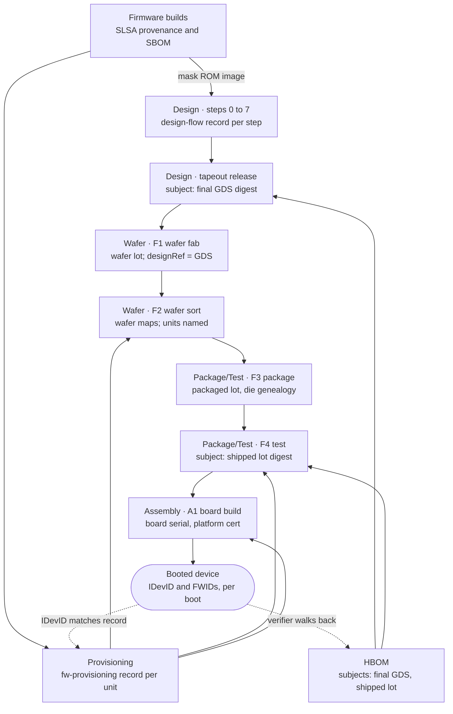

# Hardware Supply Chain Security Framework v0.1

**Status:** working draft, version 0.1 (2026-09-02)

## Overview

HSLSA is a framework for proving how a chip or board was made, the way SLSA, SBOMs and in-toto do for software. It has three parts: a level scheme a buyer can ask for, one chain of signed attestations from RTL to a booted device, and a hardware bill of materials (HBOM) that ties the chain to the product.

This is version 0.1, a working draft. It consolidates the project's earlier drafts (the unified level scheme, a standards gap analysis, design provenance for RTL-to-GDS flows, fabrication and assembly attestations, firmware attestations, and the HBOM schema) into one text, and supersedes them where they disagree.

**Scope.** Digital ASIC and SoC design from RTL to GDSII, mask making, wafer fabrication and sort, packaging and final test, board assembly, and all firmware that ships in the part or on the board, through to the device proving what it booted. Out of scope for 0.1: distribution after the first buyer, the internals of secure boot and update protocols, and firmware for off-chip components (their vendors attest it, and it enters here as a dependency). Whether analog and mixed-signal flows can reach Design L3 is an open question.

**Conventions.** MUST, SHOULD and MAY carry their RFC 2119 meaning in requirement tables. Every predicate and schema URI lives under `https://github.com/Horiodino/hw-slsa/`, the repository that hosts this spec. URIs are identifiers and need not resolve; a custom domain can replace this prefix in a later version.

## Terminology

These terms mean the same thing in every section and every predicate.

| Term | Meaning |
| --- | --- |
| Track | One stage of the supply chain rated on its own: Design, Wafer, Package/Test, Assembly or Firmware. A product states one level per track. |
| Level | What a buyer can verify about a track: L0 (no claim) to L3 in the core, plus an optional L4 defense profile. Levels are cumulative within a track. |
| Step | One attested unit of work, run by one party: a design flow step (0 to 7, plus 6a ROM merge), a manufacturing step (F1 to F4, A1), an inspection (X), a firmware build, or a provisioning pass. |
| Site | The organization and physical location that runs a manufacturing or provisioning step, identified by its site key. |
| Subject | What an attestation is about. Files are named by digest; physical things are named by a URN plus the digest of a canonical list that defines them. |
| Wafer lot | The wafers a fab started together. Subject of F1. |
| Packaged lot | Every unit that left the package line. Subject of F3. |
| Shipped lot | The units that passed final test. Subject of F4 and the lot subject of the HBOM; its digest is the lot digest. |
| Unit | One packaged part. Named by serial at Package/Test L2, and by the digest of its device identity certificate at L3. |
| Device identity | A per-unit key rooted in hardware (DICE or Caliptra class), provisioned at sort or final test and endorsed by a CA. At L3 it is the unit's name in every attestation. |
| Release attestation | The tapeout authority's signed statement over the final GDS. Every manufacturing step points at it through `designRef`. |
| Provisioning | Writing images, fuses and keys into a part at a fab, OSAT or board line. It is Firmware work, recorded in `fw-provisioning`. |
| HBOM | The signed hardware bill of materials for a product: an in-toto statement whose subjects are the GDS and the shipped lot. |
| Hierarchy level | The HBOM's `product.level` field (die, package, module, board, system). It says what kind of product this is, not how assured it is. |
| Defense profile | The optional L4 requirements: a second, independent party reaches the same result as the first. |

## Tracks and levels

A product is rated per track, never overall: for example Design L3, Wafer L3, Package/Test L2, Assembly L1, Firmware L2. Each level is defined by what a buyer can verify, and a track's level is the lowest level all of its steps reach.

| Track | Covers | Who runs it | Steps |
| --- | --- | --- | --- |
| Design | RTL, IP, PDK, EDA flow to GDSII, mask ROM contents | Design house | 0 to 7, plus 6a ROM merge |
| Wafer | Mask making, wafer fabrication, wafer sort | Foundry, mask shop, sort house | F1, F2 |
| Package/Test | Packaging, final test | OSAT, test house | F3, F4 |
| Assembly | PCB, board and system build | EMS or contract manufacturer | A1 |
| Firmware | Boot ROM, device and board firmware, provisioning | Firmware team, programming stations at fab, OSAT and EMS | Image builds, provisioning passes |

Wafer and Package/Test are separate tracks because foundry and OSAT are usually different companies, and one rating hid the weaker of them.

| Level | Name | What the buyer can verify | Status |
| --- | --- | --- | --- |
| L0 | No claim | Nothing | Core |
| L1 | Provenance exists | A complete record of how the item was made, in a standard format | Core |
| L2 | Signed by the producer | The record was produced and signed by a controlled platform or site, not typed by hand | Core |
| L3 | Hardened | Signing keys and build steps are isolated, inputs are pinned, and the subject is rooted in a hardware identity | Core |
| L4 | Independently verified | A second, independent party rebuilt or physically inspected the item and got the same answer | Optional defense profile |

Claims are written as track plus level, such as `Design L3`. An L4 claim is written `Design L4 (defense profile)` and requires L3 in the same track; tooling that checks only the core reads it as L3.

### Core requirements

Each cell adds to the one on its left.

| Track | L1: Provenance exists | L2: Signed by the producer | L3: Hardened |
| --- | --- | --- | --- |
| Design | Every flow step emits a `design-flow` attestation (tools, PDK, parameters, subject digests) and the chain from GDS back to RTL is complete; the release record lists IP blocks and versions and the GDS digest; an HBOM is published | Steps run on a managed flow platform, not a workstation, and the platform identity signs each attestation; source freeze is a signed, reviewed tag; waivers are signed by a signoff owner; third-party IP arrives with signed provenance | Steps are isolated from each other and from the network; tools and PDK are pinned by digest and on an allow-list; signing keys are unreachable from step code; formal equivalence between RTL and final netlist is recorded, and enough is attested for an independent party to rerun equivalence and LVS |
| Wafer | Lot record names the fab, mask set revision, GDS digest and probe program version | Each step signs with a site key; wafer fab names the wafer lot as subject; from sort onward, records name each unit | Keys held in HSMs at accredited sites (for example DMEA or O-TTPS); the fab verifies the design release attestation before mask making and records the mask-vs-GDS XOR; identities provisioned at sort are rooted in an on-die RoT (DICE or Caliptra class) and issued by an HSM-backed CA |
| Package/Test | Record names the OSAT, assembly lot and test program version for each lot | Each step signs with a site key; records name each unit, with genealogy to wafer and die position; every unit has a unique identity by final test; final test signs the shipped lot digest | Keys held in HSMs at accredited sites; every unit answers an identity challenge at final test, rooted in hardware; the shipped lot digest covers the units' certificate digests |
| Assembly | Board HBOM plus IPC-1782 style build records per serial number | Each assembly step signs its record against the board serial and the identities of its key components | Signing at accredited sites; component identities are checked by attestation at build; a platform certificate binds the system to its parts |
| Firmware | SLSA Build L1 provenance and an SBOM for every image; mask ROM content is proven by the Design track's ROM merge step | SLSA Build L2; images are signed and verified before the SoC runs them, by a secure-boot ROM on the silicon or by an attested board-level root of trust (proposed); a part with neither stops at Firmware L1 | SLSA Build L3; firmware is independently reviewed (S.A.F.E. style); releases appear in a transparency log; the device reports firmware measurements under a DICE or Caliptra class identity, and they match the attested image digests |

Three rules apply across tracks:

1. **Transparency logs may be private.** Every L3 log requirement is met by a private log (a private Rekor instance, or an RFC 9162 style log run by the buyer or a consortium), since no foundry will publish lot IDs or yields.
2. **Provisioning is Firmware, rated by its site.** Firmware Ln needs every provisioning site rated at least Ln in its own track (Wafer, Package/Test or Assembly).
3. **One check for the buyer.** At every level the buyer collects the attestations, confirms each subject matches the identity the device proves at boot, and compares the stated levels against policy. From Design L3, the tapeout check also requires the equivalence record.

**Firmware L2 through a board-level root of trust (proposed resolution).** A part without a secure-boot ROM MAY reach Firmware L2 on a board whose root of trust verifies the external flash, but only when that root of trust is itself attested (its own HBOM entry, Firmware provenance and provisioning record at L2 or higher) and it verifies each image before the SoC is released from reset. The claim is made for the board, not the bare part. This answers the open question in the level scheme and still needs the owner's sign-off.

### L4 defense profile

L4 is opt-in because its costs (a second builder, destructive part sampling) only make sense for root-of-trust, secure-element and defense parts.

| Track | L4 requirement (on top of L3) | Stops |
| --- | --- | --- |
| Design | A second, independently operated builder rebuilds from the same source and inputs and reaches a bit-exact or equivalent result, including the ROM macro; two-person review on source freeze and waivers; tapeout release signed with an HSM key | A compromised flow platform or an insider on one builder |
| Wafer | Named regions of sampled die are delayered, imaged and compared against the signed GDS by an independent lab | Layout-level trojans and mask substitution at the foundry |
| Package/Test | Sampled units are decapsulated and X-rayed by an independent lab, and each die is matched to its genealogy and the signed GDS | Die swapped or remarked at the OSAT |
| Assembly | Sampled boards are X-rayed and components authenticated (SAE AS6171 style) by an independent lab, checked against the board HBOM | Counterfeit or substituted components that pass electrical test |
| Firmware | An independent party reproduces each image built from source bit for bit; two-person review on releases; per-unit data is covered by provisioning readback instead; a closed vendor binary caps the product at Firmware L3 unless its vendor supplies an independent rebuild | A compromised firmware build system or insider |

Wafer and Package/Test samples are drawn from the shipped lot after final test, so one inspection can serve both tracks. The lab commits to a random seed before the lot is sealed, states the lot size and sampling plan, and signs under a trust root separate from the producer's.

**SLSA and DoD alignment.** Design Ln and Firmware Ln each meet SLSA Build Ln for n from 1 to 3. From L2, Firmware adds device and review requirements SLSA does not have, so tooling must not treat the two as equal. How HSLSA lines up with DoD Microelectronics Levels of Assurance is inferred, not established: L3 in all tracks may approach LoA2, and the L4 profile may approach LoA3.

## Attestation model

Every record in HSLSA is an [in-toto Statement v1](https://github.com/in-toto/attestation/blob/main/spec/v1/statement.md) in a DSSE envelope. The step predicates are strict supersets of SLSA Provenance v1: `buildDefinition` and `runDetails` keep their SLSA meaning, and hardware fields sit in one extra block, so an unmodified SLSA verifier can check signer, subjects and inputs.

### Predicate types

| Predicate | URI | Extra block | Emitted by | Subject |
| --- | --- | --- | --- | --- |
| Design flow step | `https://github.com/Horiodino/hw-slsa/design-flow/v0.1` | `hwFlow` | Flow platform, per step and once as a run summary | Output files of the step; the final GDS for the summary |
| Tapeout release | `https://github.com/Horiodino/hw-slsa/design-flow/v0.1`, buildType `.../design-flow/step/release@v1` | `hwFlow` | Tapeout authority | Final GDS |
| Manufacturing step | `https://github.com/Horiodino/hw-slsa/manufacturing-step/v0.1` | `hwMfg` | Fab, sort, OSAT, test and EMS sites | Wafer lot, packaged lot, shipped lot or board |
| Physical inspection (L4) | `https://github.com/Horiodino/hw-slsa/physical-inspection/v0.1` | none | Independent lab | Shipped lot and each sampled unit or board |
| Firmware image build | `https://slsa.dev/provenance/v1` (unchanged) | none | Firmware build platform | Image digest |
| Firmware provisioning | `https://github.com/Horiodino/hw-slsa/fw-provisioning/v0.1` | none | Programming station at fab, OSAT or EMS | Each unit written |
| Firmware review | `https://github.com/Horiodino/hw-slsa/fw-review/v0.1`, wrapping an OCP S.A.F.E. report | none | Review provider | Image digest |
| HBOM | `https://github.com/Horiodino/hw-slsa/hbom/v0.1` | none | Product owner | Final GDS and shipped lot |
| Verification summary | `https://slsa.dev/verification_summary/v1` | none | Vendor or buyer verifier | Any subject above |

Step types are named `https://github.com/Horiodino/hw-slsa/design-flow/step/<step>@v1` and `https://github.com/Horiodino/hw-slsa/mfg/step/<step>@v1`. A verification summary reports levels as `HSLSA_<TRACK>_LEVEL_<n>` (for example `HSLSA_WAFER_LEVEL_3`); SLSA allows custom `verifiedLevels` values that do not start with `SLSA_`.

### Naming subjects

Files are named by sha256 (sha384 where a device reports SHA-384 measurements, as Caliptra does). Physical things have no file digest, so each one is a URN plus the digest of the canonical list that defines it. All physical names use one URN prefix, `urn:hslsa:`.

| Thing | Name | Digest over |
| --- | --- | --- |
| Wafer lot | `urn:hslsa:wafer-lot:<fab-id>:<lot-id>` | Its sorted wafer IDs |
| Wafer map | The map file (SEMI E142 or the foundry's format) | File digest |
| Packaged lot | `urn:hslsa:assembly-lot:<lot-id>` | Every unit that left the package line |
| Shipped lot | `urn:hslsa:lot:<lot-id>` | The lot digest (below) |
| Unit | `urn:hslsa:unit:<serial>` | The serial at Package/Test L2; the DER identity certificate at L3 |
| Board | `urn:hslsa:board:<manufacturer>:<serial>` | The board's identity certificate, or its serial |

### Lot digest

The shipped lot digest is the single binding between the HBOM and the physical units. It is computed the same way wherever it appears (F4, the HBOM, inspection records):

```math
\mathrm{lotDigest} = \mathrm{SHA256}\big(\mathrm{join}(\mathrm{sort}(u_1, \dots, u_n), \texttt{\textbackslash n}) \,\|\, \texttt{\textbackslash n}\big)
```

Each unit identifier is the serial (Package/Test L2) or the lowercase hex sha256 of the unit's identity certificate in DER (Package/Test L3), sorted as byte strings, joined with newlines and ending in one newline. Yield loss changes the lot between packaging and shipment, so F3 names the packaged lot and F4 names the shipped lot; the verifier checks that shipped units are a subset of packaged ones and that F4's yield record accounts for the rest.

### Signing and keys

Platforms and sites sign step records; people sign only decisions.

| Signer | Signs | Key model |
| --- | --- | --- |
| Design flow platform | Every design step and the run summary | Sigstore keyless (OIDC workload identity to Fulcio), or a private Sigstore or HSM-held X.509 key for air-gapped flows |
| Design engineer | Source freeze tag, ECO attestations | Personal key, or keyless with corporate SSO |
| Signoff owner | Waivers, signoff approval | Hardware token (FIDO2 or smart card) |
| Tapeout authority | Release attestation over the GDS | Offline or HSM-held key |
| IP and PDK vendors | Their own deliverables | Vendor key in a trust root (open question) |
| Foundry, sort, OSAT, test and EMS sites | Every manufacturing step | X.509 site key, in an HSM from L3; the certificate names the site and its accreditation |
| Process or quality engineer | Deviations, rework orders, bin-limit waivers | Hardware token |
| Identity provisioning CA | Unit identity certificates | HSM-held CA key per product line |
| Firmware build platform | Image provenance and SBOM | As for the design flow platform |
| Programming station | `fw-provisioning` records | The site key of the site it sits in |
| Independent lab (L4) | Inspection records | Lab's own key under a trust root separate from the producer's |

### Rules every step follows

1. **Decisions are inputs.** Waivers, process deviations, rework orders and bin-limit waivers are `externalParameters` with their own digest and signer.
2. **Edits and rework are steps.** An ECO, manual layout fix, reworked wafer or re-marked package gets its own attestation; anything that re-enters the chain without one breaks it on purpose.
3. **Nothing disappears silently.** Scrap is recorded in the yield block, so a lot cannot gain or swap units unnoticed.
4. **Confidential values are digests.** A field a supplier will not disclose (recipe, yield, fab site, wafer IDs, third-party IP) is replaced by a salted digest and listed by JSON Pointer (`hwMfg.confidential[]` in step records, `redactions[]` in the HBOM). An auditor given the salt can confirm the value.
5. **Third-party inputs are dependencies.** Hard IP, cell libraries, PDKs and vendor firmware are pinned by digest in `resolvedDependencies`, with the vendor's own attestation linked when one exists.

## The attestation chain

A verifier holding a booted device can walk by digest alone from its identity certificate to the shipped lot, back through packaging and the wafer lot to the signed GDS, and from there to reviewed RTL and every tool and PDK used. Each step lists the previous step's subjects in `resolvedDependencies`, and every manufacturing step copies the GDS release into `hwMfg.designRef`.



Each arrow is a digest link. Firmware joins twice: mask ROM content through the Design flow, everything else through provisioning records. The dashed lines are the checks a verifier runs from a live device.

### Steps

| Step | Track | Consumes (by digest) | Produces (subject) | Key gates in `checks` |
| --- | --- | --- | --- | --- |
| 0. Source freeze | Design | RTL tree, testbenches, constraints, IP manifests | Source archive | Signed tag; two-person review at L4 |
| 1. Simulation and lint | Design | Source archive, testbenches, IP models | Coverage and log reports | Tests pass, coverage threshold |
| 2. Synthesis | Design | Source archive, liberty files | Gate-level netlist, SDC | Lint clean; netlist vs RTL equivalence |
| 3. Floorplan and power | Design | Netlist, SDC, tech and cell LEF | ODB/DEF | Macro placement check |
| 4. Placement and CTS | Design | Floorplan ODB | Placed ODB | Post-CTS timing |
| 5. Routing | Design | Placed ODB | Routed ODB/DEF, SPEF | Route DRC count = 0 |
| 6. Signoff | Design | Routed layout, SPEF, DRC and LVS decks | Timing, DRC, LVS reports | STA met, DRC clean, LVS match, waivers digest |
| 6a. ROM merge (mask ROM only) | Design, for Firmware | ROM image (by its SLSA provenance digest), ROM compiler, empty ROM macro | Programmed ROM macro GDS, merged layout | `rom-readback`: bits extracted from layout match the image digest |
| 7. GDS stream-out | Design | Routed layout, cell, IP and ROM macro GDS | Final GDSII/OASIS | GDS vs DEF XOR clean |
| Release | Design | Run summary over steps 0 to 7 | Final GDS | Tapeout policy check (below) |
| F1. Wafer fabrication | Wafer | GDS release, mask set record | Wafer lot | Mask data vs GDS XOR; inline parametrics |
| F2. Wafer sort | Wafer | F1, wafer lot | Wafer maps; unit identities if provisioned here | Probe pass; identity provisioning log |
| F3. Packaging | Package/Test | F2, wafer maps, package material certificates | Packaged lot, die-to-unit genealogy | Die attach, wire bond, X-ray sample, marking |
| F4. Final test | Package/Test | F3, packaged lot | Shipped lot, unit identities, STDF results | Final test per unit; identity challenge; yield within limits |
| Firmware build | Firmware | Firmware source and toolchain | Image and its SBOM | As for any SLSA build |
| Provisioning | Firmware | Images (after verifying their provenance), fuse map, key origins | Each unit written | Readback digest per image and fuse field |
| A1. Board assembly | Assembly | F4 records of the parts used, board HBOM, bare PCB lot | Board serial; platform certificate at L3 | AOI, BGA X-ray, ICT; component identity check at L3 |
| X. Inspection (L4) | Wafer, Package/Test or Assembly | Sampled units or boards, committed seed | Result over lot and sampled identities | Per-unit pass, fail or inconclusive |

The design steps stop at the signed GDS release; mask data preparation (OPC, fracturing) happens inside the foundry and is recorded in F1. On a multi-project wafer, F1 is issued once per customer design, so no customer sees another's GDS digest. Wafer lots and assembly lots are many-to-many, so F3 records (wafer lot, wafer, X, Y) for every unit.

### Mask ROM

A mask ROM is firmware by build and silicon by delivery, and nothing on the running device can check it, because it does the checking. Its trust therefore runs through the Design track: the image carries ordinary SLSA provenance, and step 6a proves with `rom-readback` that the layout holds exactly that image. Three rules follow. The ROM image's provenance must exist before step 6a, so ROM firmware reaches Firmware L1 no later than the chip reaches Design L1. ROM patches held in OTP are provisioned data, recorded in `fw-provisioning`. At Design L4 the independent rebuild must reproduce the ROM macro, which needs the image to rebuild bit for bit.

### Provisioning

The programming station is the firmware's last builder. For every part it writes it MUST verify each image's provenance before writing, read back every image and fuse field and record the readback digest, name secrets only by key id and origin (`generated-on-die`, or the injecting HSM), record the IDevID public key digest and endorsing CA for DICE or Caliptra parts, and sign with its site's key. One record MAY cover a lot programmed in one pass; from Firmware L3 each unit's identity is its own subject.

| Stage | Site | Typically written |
| --- | --- | --- |
| Wafer sort | Fab or test house | Identity seed (UDS), lifecycle state, trim and calibration fuses |
| Final test | OSAT | Remaining fuses, on-die flash images, IDevID CSR export for endorsement |
| Board assembly | EMS | External flash images, board-level keys, platform certificate inputs |

### Where the chain is checked

**At tapeout**, before the GDS leaves for the foundry:

1. The GDS digest matches the release attestation, signed by an allowed tapeout authority.
2. Every step from source freeze to stream-out is present, signed by an allowed builder, and linked by digest.
3. Every tool and PDK digest is on the approved list.
4. Every required gate passed, every waiver is signed by a signoff owner, and a chip with a mask ROM passed `rom-readback`.
5. From Design L3, an equivalence record between RTL and final netlist exists; at Design L4, a rebuild or equivalence record from an independent builder also exists.

**At lot receipt**, by the buyer, OEM or EMS:

1. The HBOM's lot subject equals the F4 shipped lot digest, and every received unit is in it (at L3, each unit answers a challenge with a certificate whose digest is in the lot).
2. F1 to F4 are all present, signed by allowed sites, and linked by digest.
3. Every step's `designRef` names the same GDS, and its release attestation verifies at the buyer's minimum Design level.
4. Genealogy is complete and yields reconcile from F2 to F4.
5. Every required gate passed and every deviation or rework is signed.
6. For an L4 claim, an inspection record from an allowed lab covers the lot, with an acceptable sampling plan and no failed sample.

Board assembly runs this same check on each part before placement, then adds A1, so a system integrator verifies the board and, through it, every part.

**At boot**, for a Firmware L3 claim:

1. Check the device's certificate chain to the vendor CA, as any DICE verifier does.
2. Find the `fw-provisioning` record whose subject is the IDevID public key digest; it gives the lot, site, fuse state and HBOM.
3. For each FWID in the alias certificates (TCG DICE TcbInfo), find image provenance with that digest as subject, and check its level, review and log inclusion.
4. Confirm the HBOM's GDS has a Design chain whose ROM merge step passed `rom-readback`; that is the only way the mask ROM, which took the first measurement, is covered.
5. Compare each image's SVN in its provenance with the anti-rollback fuse value in the provisioning record.

Policy can be written in existing in-toto tooling (layouts, witness policies or Rego), because the envelopes are standard.

## Hardware bill of materials

The HBOM is the one document a buyer starts from: it lists what the product is made of and who made each part, and points by digest at every attestation in the chain rather than copying them. It is required from Design L1.

**Format.** The HBOM is a CycloneDX 1.6 document at its core, with every extension also mapped to SPDX 3.1 so either can be emitted. SPDX 3.0 has no hardware profile; the mapping targets the SPDX 3.1 release candidate (Hardware classes `PhysicalHardware`, `BulkHardware`, `VirtualHardware`; SupplyChain classes `ManufactureProcess`, `AssemblyProcess`, `TestProcess`, `ResponsibilityChangeProcess`) and will be rechecked when 3.1 is final. New fields live in one `hbom:` namespace; in CycloneDX they travel as properties prefixed `hbom:`.

**Envelope and subjects.** The HBOM ships as the predicate of an in-toto Statement with predicate type `https://github.com/Horiodino/hw-slsa/hbom/v0.1` and two subjects:

1. **Design subject:** the final GDS, by sha256. Every part from this tapeout shares it.
2. **Lot subject:** `urn:hslsa:lot:<lot-id>`, the shipped lot from F4, with the lot digest as its digest. A verifier holding one part checks its serial or identity certificate against that lot.

**Predicate.** Only `hbomVersion`, `product` and `manufacturing.fab` are required, so a shuttle chip with little data still validates; the rest fills in as a supplier climbs levels.

| Block | Holds | Points at |
| --- | --- | --- |
| `product` | Name, hierarchy level (die, package, module, board, system), part number, revision, manufacturer, purl, device identity scheme | Nothing |
| `renderings[]` | Full CycloneDX or SPDX documents for the same product | Each by digest |
| `design` | IP blocks (kind, supplier, license, IEEE 1735 flag), RTL sources by commit, PDK, flow steps and tools, final layout | Each flow step's `design-flow` attestation via `provenanceRef` |
| `manufacturing` | Foundry, process node, mask set, shuttle, wafer lots, OSAT and package, test stages and programs | F1 via `fab.attestationRef`, F3 via `assembly.attestationRef`, F2 and F4 results via `test[].resultsRef` |
| `firmware[]` | Each image's name, role, storage (mask-rom, otp, on-die-flash, external-flash) and digest | Its SBOM via `sbomRef` |
| `parts[]` | For boards: manufacturer, MPN, date code, lot, distributor, authorized channel | The part's own HBOM via `hbomRef` |
| `redactions[]` | JSON Pointers to withheld fields and their salted digests | Nothing |

**Changes from the HBOM draft.** This spec makes four changes to the draft schema so it fits the rest of the chain:

1. The lot subject is renamed from `urn:hbom:lot:` to `urn:hslsa:lot:` and names the shipped lot, with the lot digest defined above (serials at Package/Test L2, certificate digests at L3).
2. The supplier slices the draft left undefined are the `manufacturing-step` records defined here: `fab.attestationRef` points at F1, `assembly.attestationRef` at F3, and `test[].resultsRef` at the F2 or F4 results that record signs.
3. `flowStep.step` gains `rom-merge` and `release`, so the HBOM can reference every Design step.
4. `product.level` keeps its name but is documented as the hierarchy level only; assurance levels are not stated in the HBOM (see open questions).

The JSON Schema and the PicoSoC worked example are in this repository at [`hbom/hbom-predicate-v0.1.schema.json`](../hbom/hbom-predicate-v0.1.schema.json) and [`hbom/picosoc-sky130.hbom.intoto.json`](../hbom/picosoc-sky130.hbom.intoto.json), already updated for these changes. [`hbom/picosoc-sky130.shipped-lot.txt`](../hbom/picosoc-sky130.shipped-lot.txt) is the example's canonical unit list, so the lot digest can be recomputed.

**Worked example.** The PicoRV32-based PicoSoC on SkyWater SKY130, packaged in QFN-64, reaches Design L2 in its example records and uses serial identities, so it can claim at most Package/Test L2. It stops at Firmware L1: both images live in external SPI flash, the silicon has no secure-boot ROM, and its provisioning record's empty `fuses`, `secrets` and `identity` fields show a buyer that nothing in the part anchors the firmware. Under the proposed board-level root of trust rule, a board carrying it could reach Firmware L2.

## Relationship to existing standards

HSLSA reuses an existing standard wherever one fits and adds only the glue: per-step predicates for hardware, the physical subject naming, and the rules that tie device identity to supply chain records. Citations were checked on 2026-09-02.

| Software concept | HSLSA element | Standards reused |
| --- | --- | --- |
| SLSA Build track | Design and Firmware levels; step predicates are SLSA Provenance v1 supersets | [SLSA v1.2](https://slsa.dev/spec/v1.2/) |
| in-toto attestations | Every record in the chain | [in-toto Statement v1](https://github.com/in-toto/attestation/blob/main/spec/v1/statement.md), DSSE |
| SBOM | HBOM; per-image firmware SBOMs | [CycloneDX 1.6](https://cyclonedx.org/docs/1.6/json/) (ECMA-424), [SPDX 3.1 RC](https://spdx.dev/spdx-3-1-ontology-and-schema-available-for-review/), [CISA HBOM framework](https://www.cisa.gov/resources-tools/resources/hardware-bill-materials-hbom-framework-supply-chain-risk-management) |
| Artifact digest | Device identity as the subject of a physical part | [TCG DICE](https://trustedcomputinggroup.org/resource/dice-attestation-architecture/), [Caliptra](https://www.chipsalliance.org/news/caliptra2-1/), [DMTF SPDM](https://www.dmtf.org/standards/spdm) |
| Sigstore, Rekor | Keyless signing for design and firmware platforms; public or private logs | Sigstore, [IETF SCITT (RFC 9943)](https://www.rfc-editor.org/rfc/rfc9943), RFC 9162 |
| Verification before use | Tapeout, lot receipt and boot checks | [IETF RATS (RFC 9334)](https://www.rfc-editor.org/rfc/rfc9334), [TCG Platform Certificate](https://trustedcomputinggroup.org/resource/tcg-platform-certificate-profile/), [CoRIM](https://datatracker.ietf.org/doc/draft-ietf-rats-corim/) (still an Internet-Draft) |
| Independent review | Firmware L3 review; `fw-review` | [OCP S.A.F.E.](https://github.com/opencomputeproject/OCP-Security-SAFE/blob/main/Documentation/framework.md) |
| Build records | Wafer, Package/Test and Assembly step records | [IPC-1782](https://standards.globalspec.com/std/14358527/ipc-1782) traceability, SEMI E142 wafer maps, STDF test results |
| Supplier assessment | L3 accredited sites | [DMEA Trusted Supplier](https://www.acq.osd.mil/asds/dmea/tapo/trusted-supplier-programs.html), [O-TTPS (ISO/IEC 20243)](https://www.opengroup.org/open-trusted-technology-provider%E2%84%A2-standard-o-ttps-approved-isoiec-international-standard), SEMI E187 for equipment |
| Dependency integrity | Signed IP provenance; encrypted IP flag | [IEEE 1735-2023](https://standards.ieee.org/standard/1735-2014.html), [Accellera SA-EDI](https://www.accellera.org/news/press-releases/373-accelleras-security-annotation-for-electronic-design-integration-standard-1-0-moves-toward-ieee-standardization) |
| Counterfeit detection | Assembly L4 inspection | SAE AS5553, AS6171, AS6081 |
| Assurance tiers | L3 and the L4 profile (alignment inferred) | [DoD Microelectronics Levels of Assurance](https://media.defense.gov/2022/Jul/14/2003034921/-1/-1/0/CTR_DOD_MICROELECTRONICS_LEVELS_OF_ASSURANCE_DEFINITIONS_AND_APPLICATIONS_20220714.PDF) |

Traceability work under way at [NIST IR 8536](https://www.semiconductors.org/wp-content/uploads/2025/10/SIA-Final-Comments-on-NIST-IR-8536-2pd_10.03.pdf) and [STAMP](https://csrc.nist.gov/csrc/media/Presentations/2025/semiconductor-traceability/images-media/WedAM2.2-STAMP_Intro_NIST_SSCA.pdf) could become the data layer under the manufacturing records; that is not yet decided.

## Decisions and open questions

### Where the drafts disagreed

The source drafts were not edited; this spec settles each difference as follows.

| Topic | The drafts said | This spec |
| --- | --- | --- |
| Predicate namespace | `hwslsa.dev` (design, fab, firmware) vs `hw-slsa.example` (HBOM) | `https://github.com/Horiodino/hw-slsa/` everywhere; a custom domain can replace it later |
| Physical names | `urn:hbom:lot:` and `urn:hbom:unit:` in the HBOM and firmware docs; `urn:hslsa:` for wafer lots, assembly lots and boards | One prefix, `urn:hslsa:`, for every physical subject |
| Lot subject and digest | HBOM: "the assembly lot", digest of its unit list, format undefined; fab doc: shipped lot from F4 with an exact formula | The shipped lot, with the fab doc's lot digest as the only definition |
| Unit naming | HBOM: serials or certificate digests; fab doc: serial at Package/Test L2, certificate digest at L3 | Tied to the level, as in the fab doc |
| Firmware L2 without a secure-boot ROM | Open question in the level scheme | Allowed through an attested board-level root of trust that verifies before the SoC runs, claimed for the board (proposed) |
| Supplier predicates for fab, assembly and test | HBOM left them open | The `manufacturing-step` predicate, referenced from the HBOM's `attestationRef` fields |
| Tapeout release record | Design doc names it but gives no step type | `design-flow` with buildType `.../step/release@v1` |
| Verification summary levels | Firmware doc defines `HSLSA_FIRMWARE_LEVEL_n` only | `HSLSA_<TRACK>_LEVEL_<n>` for all five tracks |
| HBOM flow steps | HBOM enum lacks the ROM merge and release | `rom-merge` and `release` added |

### Open questions

- [ ] Where do IP, PDK and site signing keys live, and who runs the trust roots: each buyer, an industry body, or the accreditors (DMEA, The Open Group)?
- [ ] Should the board-level root of trust rule for Firmware L2 be adopted as written?
- [ ] Should source integrity (reviewed RTL) and dependency integrity (IP, PDK, cell libraries) become their own tracks, as SLSA did with Source? Today they sit inside Design L2 and L3.
- [ ] Can analog and mixed-signal flows, mostly manual layout, reach Design L3?
- [ ] What sampling rate makes an L4 claim meaningful for a given lot size, and who accredits the inspection labs?
- [ ] Should the HBOM carry claimed levels per track, so one document states them, or should levels live only in verification summaries?
- [ ] Should HBOM `firmware[]` entries gain a provenance reference and expected boot measurement, and should reference values be published as CoRIM?
- [ ] Is the `fw-review` wrapper needed, given S.A.F.E. reports are already signed and defined as a CoRIM profile?
- [ ] Who endorses IDevID certificates when the OSAT, not the chip vendor, holds the provisioning station?
- [ ] Should the foundry verify provenance at GDS intake, or only the design house before release? (Wafer L3 already asks the fab to verify the release.)
- [ ] How much of `hwFlow.metrics` and `hwMfg` data is safe to disclose to the next party, and are salted digests enough for encrypted IP and NDA-bound PDKs, or is verifier escrow needed?
- [ ] Can an MES emit these records natively, or does it need a signing sidecar?
- [ ] Which neutral home should own the spec long term (OpenSSF, CHIPS Alliance, OCP or a joint group), beyond the owner's repository?
- [ ] Track SPDX 3.1 from release candidate to final, and CoRIM from Internet-Draft to RFC.

### Next steps

- [x] Regenerate the HBOM schema and PicoSoC example for the changes above.
- [ ] Prototype: wrap an OpenLane 2 run of a small SKY130 design so each step emits a signed attestation, and measure how close a second run gets to bit-exact.
- [ ] Write one end-to-end example on a part with a hardware identity (a Caliptra-based SoC or OpenTitan), from RTL to a booted device.
- [ ] Add a board-level example to exercise `parts[]`, distributor lot data and A1.
